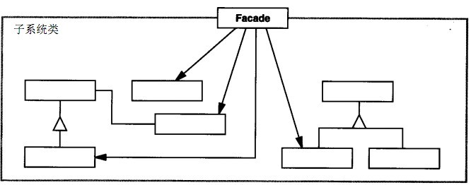

## 外观模式

### 介绍

为子系统中的一组接口提供一个一致的界面，定义一个高层接口，这个接口使得这一子系统更加容易使用。
就像下图，facade把众多子系统中通过一个接口统一起来：


#### 适用场景

1. 设计初期阶段，应该有意识的将不同层分离，层与层之间建立外观模式。
2.  开发阶段，子系统越来越复杂，增加外观模式提供一个简单的调用接口。
3.  维护一个大型遗留系统的时候，可能这个系统已经非常难以维护和扩展，但又包含非常重要的功能，为其开发一个外观类，以便新系统与其交互。


#### 优点

1. 实现了子系统与客户端之间的松耦合关系。
2. 客户端屏蔽了子系统组件，减少了客户端所需处理的对象数目，并使得子系统使用起来更加容易。
3. 提高了安全性。

### DEMO

子系统：
```
package factory.pattern.facade;

/**
 * Created by FK on 2017/8/1.
 */
public interface Shape {
    void draw();
}

package factory.pattern.facade;

/**
 * Created by FK on 2017/8/1.
 */
public class Circle implements Shape {
    @Override
    public void draw() {
        System.out.println("Circle::draw()");
    }
}

package factory.pattern.facade;

/**
 * Created by FK on 2017/8/1.
 */
public class Rectangle implements Shape {
    @Override
    public void draw() {
        System.out.println("Rectangle::draw()");
    }
}

package factory.pattern.facade;

/**
 * Created by FK on 2017/8/1.
 */
public class Square implements Shape {
    @Override
    public void draw() {
        System.out.println("Square::draw()");
    }
}
```

facade :
```
package factory.pattern.facade;

/**
 * Created by FK on 2017/8/1.
 */
public class ShapeFacade {
    private Shape circle;
    private Shape rectangle;
    private Shape square;

    public ShapeFacade() {
        circle = new Circle();
        rectangle = new Rectangle();
        square = new Square();
    }

    public void drawCircle(){
        circle.draw();
    }

    public void drawRectangle(){
        rectangle.draw();
    }

    public void drawSquare(){
        square.draw();
    }
}
```
测试类：
```
package factory.pattern.facade;

/**
 * Created by FK on 2017/8/1.
 */
public class FacadeTest {
    public static void main(String[] args) {
        ShapeFacade shapeFacade = new ShapeFacade();

        shapeFacade.drawCircle();
        shapeFacade.drawRectangle();
        shapeFacade.drawSquare();
    }
}
```


