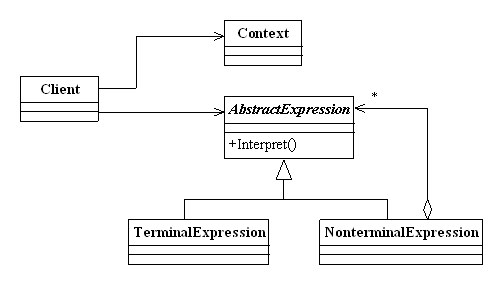

## 解释器模式

### 介绍

解释器模式：给定一个语言，定义它的文法的一种表示，并定义一个解释器，这个解释器使用该表示来解释语言中的句子。（行为型模式）

解释器模式uml图一般如下：



- AbstractExpression 抽象解释器

&nbsp;&nbsp;&nbsp;&nbsp; 具体的解释任务由各个实现类完成，具体的解释器分别由TerminalExpression和NonterminalExpression完成。

- TerminalExpression终结符表达式

&nbsp;&nbsp;&nbsp;&nbsp;实现与文法中的元素相关联的解释操作，通常一个解释器模式中只有一个终结符表达式，但有多个实例，对应不同的终结符。具体到我们例子就是VarExpression类，表达式中的每个终结符都在堆栈中产生了一个VarExpression对象。

- NonterminalExpression 非终结符表达式

&nbsp;&nbsp;&nbsp;&nbsp;文法中的每条规则对应于一个非终结表达式，具体到我们的例子就是加减法规则分别对应到AddExpression和SubExpression两个类。非终结符表达式根据逻辑的复杂程度而增加，原则上每个文法规则都对应一个非终结符表达式。

- Context 环境角色

&nbsp;&nbsp;&nbsp;&nbsp;具体到我们的例子中是采用HashMap代替。

> 正则表达式就是使用了解释器模式
> 解释器模式在实际的系统开发中使用的非常少，因为它会引起效率、性能以及维护等问题，一般在大中型的框架型项目能够找到它的身影，比如一些数据分析工具、报表设计工具、科学计算工具等等，若你确实遇到“一种特定类型的问题发生的频率足够高”的情况，准备使用解释器模式时，可以考虑一下Expression4J、MESP（Math Expression String Parser）、Jep等开源的解析工具包，功能都异常强大，而且非常容易使用，效率也还不错，实现大多数的数学运算完全没有问题.

### 优缺点

#### 优点

解释器是一个简单语法分析工具，它最显著的优点就是扩展性，修改语法规则只要修改相应的非终结符表达式就可以了，若扩展语法，则只要增加非终结符类就可以了。

#### 缺点

- 每个语法都要产生一个非终结符表达式，语法规则比较复杂时，就可能产生*大量的类文件*，为维护带来了非常多的麻烦。

- 解释器模式采用递归调用方法，如果要排查一个语法错误，要一个一个断点的调试下去，会很麻烦。

- 解释器模式使用了大量的循环和递归，特别是用于解析复杂、冗长的语法时，效率会很低。

### DEMO

设计一个四则运算（这里只写了加减），可以应用各种模型公式。uml图如下：


代码如下：
 
抽象解释器

```
package factory.pattern.interpreter;

import java.util.HashMap;

/**
 * Created by FK on 2017/8/11.
 */
public abstract class Expression {
   public abstract int interpreter(HashMap<String, Integer> var);
}
```

抽象非终结符表达式，定义文法中的规则

```
package factory.pattern.interpreter;

/**
 * Created by FK on 2017/8/11.
 */
public abstract class SymbolExpression extends Expression {
    protected Expression left;
    protected Expression right;

    public SymbolExpression(Expression left, Expression right) {
        this.left = left;
        this.right = right;
    }
}
```

具体的非终结符表达式

```
package factory.pattern.interpreter;

import java.util.HashMap;

/**
 * Created by FK on 2017/8/11.
 */
public class AddExpression  extends SymbolExpression{

    public AddExpression(Expression left, Expression right) {
        super(left, right);
    }

    @Override
    public int interpreter(HashMap<String, Integer> var) {
        return super.left.interpreter(var) + super.right.interpreter(var);
    }
}
```

具体的非终结符表达式

```
package factory.pattern.interpreter;

import java.util.HashMap;

/**
 * Created by FK on 2017/8/11.
 */
public class SubExpression extends SymbolExpression {
    public SubExpression(Expression left, Expression right) {
        super(left, right);
    }

    @Override
    public int interpreter(HashMap<String, Integer> var) {
        return super.left.interpreter(var) - super.right.interpreter(var);
    }
}
```

终结符表达式

```
package factory.pattern.interpreter;

import java.util.HashMap;

/**
 * Created by FK on 2017/8/11.
 */
public class VarExpression extends Expression {
    private String key;

    public VarExpression(String key) {
        this.key = key;
    }

    @Override
    public int interpreter(HashMap<String, Integer> var) {
        return var.get(key);
    }
}
```

Calcuator的作用是封装，根据迪米特原则，Client只与直接的朋友Calcuator交流，与其他类没关系。
 
```
package factory.pattern.interpreter;

import java.util.HashMap;
import java.util.Stack;

/**
 * Created by FK on 2017/8/11.
 */
public class Calculator {
    //表达式
    private Expression expression;

    public Calculator(String expStr){
        Stack<Expression> stack = new Stack<>();
        //表达式拆分为字符数组
        char[] charArray = expStr.toCharArray();

        Expression left = null;
        Expression right = null;
        for(int i=0;i<charArray.length;i++){
            switch (charArray[i]){
                case '+' :
                    left = stack.pop();
                    right = new VarExpression(String.valueOf(charArray[++i]));
                    stack.push(new AddExpression(left, right));
                    break;
                case '-':
                    left = stack.pop();
                    right = new VarExpression(String.valueOf(charArray[++i]));
                    stack.push(new SubExpression(left,right));
                    break;
                default:
                    stack.push(new VarExpression(String.valueOf(charArray[i])));
            }
        }
        this.expression = stack.pop();
    }

    public int run(HashMap<String, Integer> var){
        return this.expression.interpreter(var);
    }
}
```

测试
```
package factory.pattern.interpreter;

import java.io.BufferedReader;
import java.io.IOException;
import java.io.InputStreamReader;
import java.util.HashMap;

/**
 * Created by FK on 2017/8/11.
 */
public class Test {
    public static void main(String[] args) throws IOException {
        String expStr = getExpStr();

        HashMap<String, Integer> var = getValue(expStr);

        Calculator calculator = new Calculator(expStr);
        System.out.println("运算结果为："+expStr +"="+calculator.run(var));
    }

    public static String getExpStr() throws IOException {
        System.out.println("输入表达式");
        return (new BufferedReader((new InputStreamReader(System.in)))).readLine();
    }

    public static HashMap<String, Integer> getValue(String expreStr) throws IOException {
        HashMap<String, Integer> map = new HashMap<>();
        for(char ch : expreStr.toCharArray()){
            if(ch != '+' && ch != '-'){
                if(!map.containsKey(String.valueOf(ch))){
                    System.out.print("请输入"+ch+"的值:");
                    String in = (new BufferedReader(new InputStreamReader(System.in))).readLine();
                    map.put(String.valueOf(ch),Integer.valueOf(in));
                }
            }
        }
        return map;
    }

}
```

输出结果

```
输入表达式
a+b-c
请输入a的值:100
请输入b的值:20
请输入c的值:40
运算结果为：a+b-c=80
```