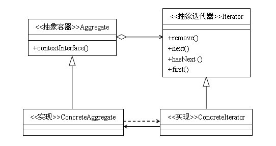

## 迭代器模式

### 介绍

迭代器模式：提供一种方法访问一个容器对象中各个元素，而又不暴露该对象的内部细节。（行为型模式）
迭代器模式是应该是java中使用的最多的一种设计模式，迭代器模式如下：


- 抽象容器：一般是一个接口，提供一个iterator()方法，例如java中的Collection接口，List接口，Set接口等。

- 具体容器：就是抽象容器的具体实现类，比如List接口的有序列表实现ArrayList，List接口的链表实现LinkList，Set接口的哈希列表的实现HashSet等。

- 抽象迭代器：定义遍历元素所需要的方法，一般来说会有这么三个方法：取得第一个元素的方法first()，取得下一个元素的方法next()，判断是否遍历结束的方法isDone()（或者叫hasNext()），移出当前对象的方法remove(),

- 迭代器实现：实现迭代器接口中定义的方法，完成集合的迭代。

### 优缺点和适用场景

#### 优点
 
- 迭代器简化了聚合的接口

- 可以提供多种遍历方式

- 在同一个聚合上可以有多个遍历

#### 缺点

- 对于比较简单的遍历（像数组或者有序列表），使用迭代器方式遍历较为繁琐，大家可能都有感觉，像ArrayList，我们宁可愿意使用for循环和get方法来遍历集合

#### 适用场景

一般来说，我们只要实现一个集合，就需要同时提供这个集合的迭代器，就像java中的Collection，List、Set、Map等，这些集合都有自己的迭代器。java本身已经把迭代器做到内部中了，我们一般情况自己很少自定义的迭代器。

### DEMO

看了JDK源码简单写了一个

首先是抽象迭代器

```
package factory.pattern.iterator;

/**
 * Created by FK on 2017/8/17.
 * 抽象迭代器类
 */
public interface Iterator<E> {
    public boolean hasNext();
    public E next();
}
```

抽象集合
```
package factory.pattern.iterator;

/**
 * Created by FK on 2017/8/17.
 */
public interface List<E> extends Iterable<E> {
    void add(E e);
    E get(int index);
    Iterator<E> iterator();
    int getSize();
}
```
抽象集合继承了iterable,iterable可以使得多个迭代器互不干扰
```
package factory.pattern.iterator;

/**
 * Created by FK on 2017/8/17.
 */
public interface Iterable<T> {
    Iterator<T> iterator();
}
```
具体的集合实现
```
package factory.pattern.iterator;

/**
 * Created by FK on 2017/8/17.
 */
public class ArrayList<E> implements List<E> {

    private Object[] elementData;
    private int size = 0;
    private int index = 0;

    public ArrayList() {
        this.elementData = new Object[10];
        this.size = 0;
        this.index = 0;
    }

    @Override
    public void add(E e) {
        elementData[index++] = e;
        size++;
    }

    @Override
    public E get(int index) {
        return (E) elementData[index];
    }

    @Override
    public Iterator<E> iterator() {
        return new ConcreteIterator();
    }

    @Override
    public int getSize() {
        return size;
    }

    private class ConcreteIterator implements Iterator<E>{
        int cursor;
        @Override
        public boolean hasNext() {
            return cursor != size ;
        }

        @Override
        public E next() {
            return (E) elementData[cursor++];
        }
    }
}
```

测试类
```
package factory.pattern.iterator;

/**
 * Created by FK on 2017/8/17.
 */
public class Test {
    public static void main(String[] args) {
        List<String> list = new ArrayList<>();
        list.add("one");
        list.add("two");
        list.add("three");
        list.add("four");
        Iterator<String> iterator = list.iterator();
        while (iterator.hasNext()){
            String str = iterator.next();
            System.out.println(str);
        }
    }
}
```