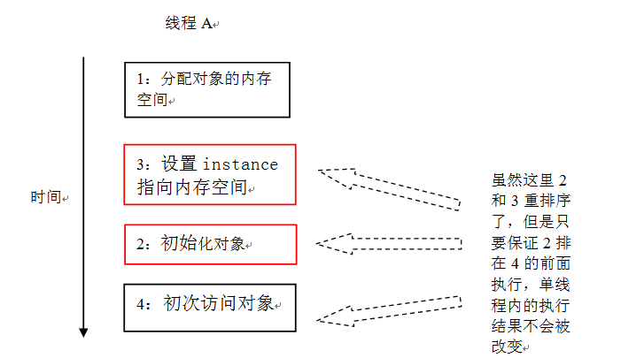
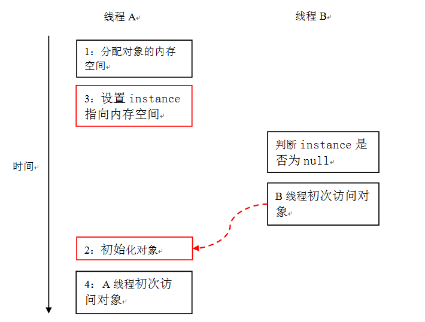

## 双重检查锁定

### 产生原因
在写Java程序的时候,有时候会推迟高开销对象的初始化,在使用的时候在进行初始化,达到lazy loading的效果.但是进行延迟初始化的时候可能会产生很多问题(多线程环境),例如:
```
public class UnsafeLazyLoading {
    private static UnsafeLazyLoading unsafeLazyLoading;
    private UnsafeLazyLoading (){}
    public static UnsafeLazyLoading getInstance(){
        if( unsafeLazyLoading == null){                     //sign 1
            unsafeLazyLoading = new UnsafeLazyLoading();    //sing 2
        }
        return unsafeLazyLoading;
    }
}
```
就比如简单的单例模式要获取唯一的实例,如果在多线程环境下如果线程A运行到 sign 1标识的行,此时线程B运行到 sing 2标识的行,线程A就会看到需要的实例还没有被初始化,就会产生问题.

处理这个可以加同步锁,代码如下:
```
public class UnsafeLazyLoading {
    private static UnsafeLazyLoading unsafeLazyLoading;
    private UnsafeLazyLoading (){}
    public synchronized static UnsafeLazyLoading getInstance(){
        if( unsafeLazyLoading == null){                     //sign 1
            unsafeLazyLoading = new UnsafeLazyLoading();    //sing 2
        }
        return unsafeLazyLoading;
    }
}
```
但是每次在获取实例的时候都会进入同步锁,会严重影响系统的性能.
所以通过双重检查锁定来实现延迟初始化,代码如下:
```
public class UnsafeLazyLoading {
    private static UnsafeLazyLoading unsafeLazyLoading;
    private UnsafeLazyLoading (){}
    public static UnsafeLazyLoading getInstance(){
        if( unsafeLazyLoading == null){                     //sign 1
            synchronized (UnsafeLazyLoading.class){
                if( unsafeLazyLoading == null){
                    unsafeLazyLoading = new UnsafeLazyLoading();   
                }
            }
            
        }
        return unsafeLazyLoading;
    }
}
```
上面这种方法看起很好
- 在多个线程试图在同一时间创建对象时，会通过加锁来保证只有一个线程能创建对象。
- 在对象创建好之后，执行getInstance()将不需要获取锁，直接返回已创建好的对象。

但是执行到 sing1 标识的地方的时候,线程有可能unsafeLazyLoading不为空的时候,但是unsafeLazyloading引用的对象还有可能没有完成初始化的过程.

> ###问题根源
> 在上述代码执行到   unsafelazyloading = new UnsafeLazyLoading(); 的时候,此时创建一个对象可分解为以下三步:
> ```
> memory = allocate();   //1：分配对象的内存空间
> ctorInstance(memory);  //2：初始化对象
> instance = memory;     //3：设置instance指向刚分配的内存地址 
> ```
> 上面三行伪代码中的2和3之间，可能会被重排序（在一些JIT编译器上，这种重排序是真实发生的，详情见参考文献1的“Out-of-order writes”部分）。2和3之间重排序之后的执行时序如下：
> ```
> memory = allocate();   //1：分配对象的内存空间
> instance = memory;     //3：设置instance指向刚分配的内存地址
>                        //注意，此时对象还没有被初始化！
> ctorInstance(memory);  //2：初始化对象
> ```
> 根据《The Java Language Specification, Java SE 7 Edition》（后文简称为java语言规范），所有线程在执行java程序时必须要遵守intra-thread semantics。intra-thread semantics保证重排序不会改变单线程内的程序执行结果。换句话来说，intra-thread semantics允许那些在单线程内，不会改变单线程程序执行结果的重排序。上面三行伪代码的2和3之间虽然被重排序了，但这个重排序并不会违反intra-thread semantics。这个重排序在没有改变单线程程序的执行结果的前提下，可以提高程序的执行性能。
> 为了更好的理解intra-thread semantics，请看下面的示意图（假设一个线程A在构造对象后，立即访问这个对象）：
> 
> 只要保证2排在4的前面，即使2和3之间重排序了，也不会违反intra-thread semantics。
> 但是在多线程执行并发的时候示意图如下:
> 
> 由于单线程内要遵守intra-thread semantics，从而能保证A线程的程序执行结果不会被改变。但是当线程A和B按上图的时序执行时，B线程将看到一个还没有被初始化的对象。
> 所以在双重检查锁定代码的（unsafeLazyLoading = new UnsafeLazyLoading();  ）如果发生重排序，另一个并发执行的线程B就有可能在第4行判断instance不为null。线程B接下来将访问instance所引用的对象，但此时这个对象可能还没有被A线程初始化！下面是这个场景的具体执行时序：
 
> |   时间 |  线程A |  线程B |
> | ------ | ----- | ------ |
> | t1  | A1：分配对象的内存空间 |   | 
> | t2 | A3：设置instance指向内存空间 |  |
> | t3 |  | B1：判断instance是否为空 |
> | t4 |  | B2：由于instance不为null，线程B将访问instance引用的对象 | 
> | t5 | A2：初始化对象 | |
> | t6 | A4：访问instance引用的对象 |  |

> 这里A2和A3虽然重排序了，但java内存模型的intra-thread semantics将确保A2一定会排在A4前面执行。因此线程A的intra-thread semantics没有改变。但A2和A3的重排序，将导致线程B在B1处判断出instance不为空，线程B接下来将访问instance引用的对象。此时，线程B将会访问到一个还未初始化的对象。
  
> 在知晓了问题发生的根源之后，我们可以想出两个办法来实现线程安全的延迟初始化：
> 1. 不允许2和3重排序；
> 2. 允许2和3重排序，但不允许其他线程“看到”这个重排序。

以上引用内容来自 http://ifeve.com/double-checked-locking-with-delay-initialization/

### 解决方案
