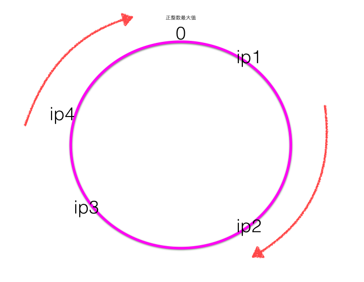
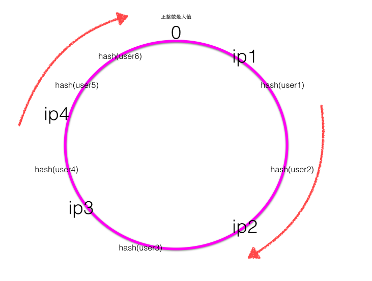
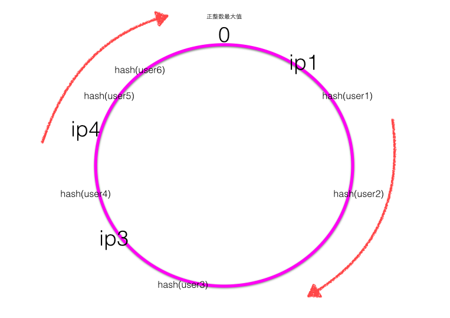
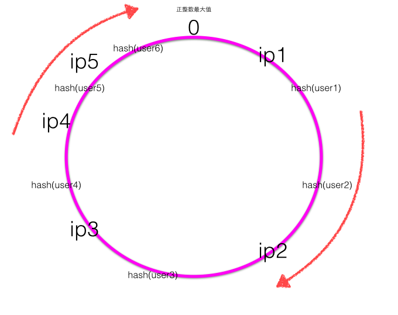
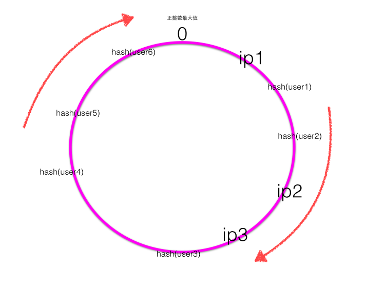
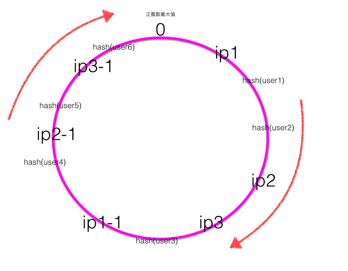

### 一致性hash

一致性hash算法是一种特殊的hash算法，在移除或添加一个服务器时，能尽可能小地改变已存在的服务请求与处理请求服务器之间的映射关系。
普通的hash算法通过hash某个维度的值去得到余数，这样在新增或者下线服务的时候，原来的映射关系就会发生大量失效。例如使用分布式缓存来缓存用户的数据，通过用户id % 服务数，当增加一个缓存服务时，原有的hash映射关系大部分都失效，这会造成缓存雪崩，导致严重的后果。

#### 原理

一致性哈希算法将整个哈希值空间映射成一个虚拟的圆环，整个哈希空间的取值范围为0~2^32-1。整个空间按顺时针方向组织。0~2^32-1在零点方向重合。接下来使用如下算法对服务请求进行映射，将服务请求使用哈希算法算出对应的hash值，然后根据hash值的位置沿圆环顺时针查找，第一台遇到的服务器就是所对应的处理请求服务器。当增加一台新的服务器，受影响的数据仅仅是新添加的服务器到其环空间中前一台的服务器（也就是顺着逆时针方向遇到的第一台服务器）之间的数据，其他都不会受到影响。综上所述，一致性哈希算法对于节点的增减都只需重定位环空间中的一小部分数据，具有较好的容错性和可扩展性 。

假设有4台服务器，地址为ip1,ip2,ip3,ip4。一致性hash会先计算四个ip对应的hash值，这样四个服务在一致性hash环上如下：

此时用户在请求时，根据hash(userId)计算路由规则，看hash到环上哪个位置，然后从环上位置顺时针找到下一个服务作为请求的服务。

如上图可知user1,user2的请求会落到服务器ip2进行处理，User3的请求会落到服务器ip3进行处理，user4的请求会落到服务器ip4进行处理，user5,user6的请求会落到服务器ip1进行处理。

当ip2的服务器挂了的时候，一致性hash环大致如下图：

根据顺时针规则可知user1,user2的请求会被服务器ip3进行处理，而其它用户的请求对应的处理服务器不变，只有ip1到iP2环之间的请求映射关系会被破坏。

如果是新增一个ip5服务：

也只有ip4到ip5之间的请求映射关系会被改变，从请求到ip1变为了请求到ip5。

#### 特性

- 单调性：单调性是指如果已经有一些请求通过hash分派到了相应的服务器进行处理，又有新的服务器加入系统时，应保证原有的请求可以被映射到原有的或新的服务器中，而不会被映射到原来的其他服务器上。
- 分散性：分布式环境中，客户端请求的时候可能不知道所有的服务器，可能只知道一部分服务器，在客户端看来他看到部分服务器会形成一个完整的还。如果多个客户端把部分服务器作为一个完整的hash环，那么可能导致，同一个用户的请求被路由到不同的服务进行处理。这种情况是应该避免的，因为不能保证同一个用户的请求落到同一个服务器。分散性就是只上述情况发生的严重程度。一致性hash具有很低的分散性。
- 平衡性：平衡性也就是说负载均衡，是指客户端hash后的请求应该能够分散到不同的服务器去。一致性hash可以做到每个服务器都进行处理请求，但是不能保证每个服务器处理的请求大致相同（如下）。

服务器ip1,ip2,ip3经过hash后落到了一致性hash环上，从图中hash值分布可知ip1会负责处理大概80%的请求，而ip2和ip3则只会负责处理大概20%的请求，虽然三个机器都在处理请求，但是明显每个机器的负载不均衡，这样称为一致性hash的倾斜，虚拟节点的出现就是为了解决这个问题。

#### 虚拟节点

当服务器节点比较少的时候会出现上节所说的一致性hash倾斜的问题，一个解决方法是多加机器，但是加机器是有成本的，那么就加虚拟节点，比如上面三个机器，每个机器引入1个虚拟节点后的一致性hash环的图如下：

其中ip1-1是ip1的虚拟节点，ip2-1是ip2的虚拟节点，ip3-1是ip3的虚拟节点。
可知当物理机器数目为M，虚拟节点为N的时候，实际hash环上节点个数为M*N。比如当客户端计算的hash值处于ip2和ip3或者处于ip2-1和ip3-1之间时候使用ip3服务器进行处理。

