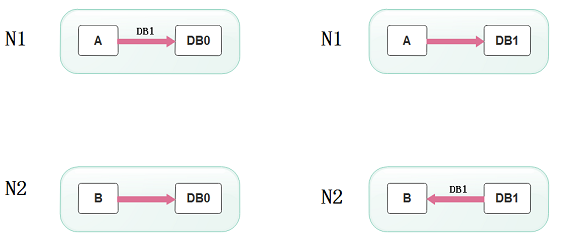

### CAP理论

CAP原则又称CAP定理，指的是在一个分布式系统中，一致性（Consistency）、可用性（Availability）、分区容错性（Partition tolerance）。CAP原则指的是，这三个要素最多只能同时实现两点，不能三者兼顾。

- 一致性（C）：在分布式系统中的所有数据备份，在同一时刻是否完全一致。对于关系型数据库，要求更新过的数据能被后续的访问都能看到，这是强一致性。如果能容忍后续的部分或者全部访问不到，则是弱一致性。如果经过一段时间后要求能访问到更新后的数据，则是最终一致性。CAP中说，不可能同时满足的这个一致性指的是强一致性。
- 可用性（A）：在集群中一部分节点故障后，集群整体是否还能对请求作出响应。
- 分区容错性（P）：是指在分布式系统在遇到某节点或者网络分区故障的时候，仍然能够对外提供满足一致性和可用性的服务。

#### CAP证明

假设有两台服务器，一台放着应用A和数据库，一台放着应用B和数据库，他们之间的网络可以互通，也就相当于分布式系统的两个部分。

在满足一致性的时候，两台服务器 N1和N2，一开始两台服务器的数据是一样的，DB0=DB0。在满足可用性的时候，用户不管是请求N1或者N2，都会得到立即响应。在满足分区容错性的情况下，N1和N2有任何一方宕机，或者网络不通的时候，都不会影响N1和N2彼此之间的正常运作。       

当用户通过N1中的A应用请求数据更新到服务器DB0后，这时N1中的服务器DB0变为DB1，通过分布式系统的数据同步更新操作，N2服务器中的数据库也更新为了DB1，这时，用户通过B向数据库发起请求得到的数据就是即时更新后的数据DB1。
上面是正常运作的情况，但分布式系统中，最大的问题就是网络传输问题，现在假设一种极端情况，N1和N2之间的网络断开了，但我们仍要支持这种网络异常，也就是满足分区容错性。
假设N1和N2之间通信的时候网络突然出现故障，有用户向N1发送数据更新请求，那N1中的数据DB0将被更新为DB1，由于网络是断开的，N2中的数据库仍旧是DB0；如果这个时候，有用户向N2发送数据读取请求，由于数据还没有进行同步，应用程序没办法立即给用户返回最新的数据DB1，怎么办呢？有二种选择，第一，牺牲数据一致性，响应旧的数据DB0给用户；第二，牺牲可用性，阻塞等待，直到网络连接恢复，数据更新操作完成之后，再给用户响应最新的数据DB1。
这就说明了要满足分区容错性的分布式系统，只能在一致性和可用性两者中，选择其中一个。也就是说分布式系统不可能同时满足三个特性。
#### CAP权衡

- CA：这种情况在分布式系统几乎不存在。因为在分布式环境下，网络分区是一个自然的事实。所以分区是必然的，如果舍弃了P，那就没有分布式系统的概念了，就没有必要讨论CAP原则了。对于一个分布式系统来说，P是一个基本要求，CAP三者中，只能在CA两者之间做权衡，并且要想尽办法提升P。
- CP：如果一个分布式系统不要求强的可用性，容许系统停机或者长时间无响应，那可以舍弃A。设计成CP的系统其实也不少，其中最典型的就是很多分布式数据库，他们都是设计成CP的。在发生极端情况时，优先保证数据的强一致性，代价就是舍弃系统的可用性。如Redis、HBase等，还有分布式系统中常用的Zookeeper也是在CAP三者之中选择优先保证CP的。
- AP：要高可用并允许分区，则需放弃一致性。一旦网络问题发生，节点之间可能会失去联系。为了保证高可用，需要在用户访问时可以马上得到返回，则每个节点只能用本地数据提供服务，而这样会导致全局数据的不一致性。但是大部分系统中舍弃了一致性选择可用性，其实舍弃了强一致性，保证了最终一次性。例如买火车票时，下单时还有票但是实际可能没票了，会出现短暂的数据不一致的情况，但是最终数据会保证一致。
