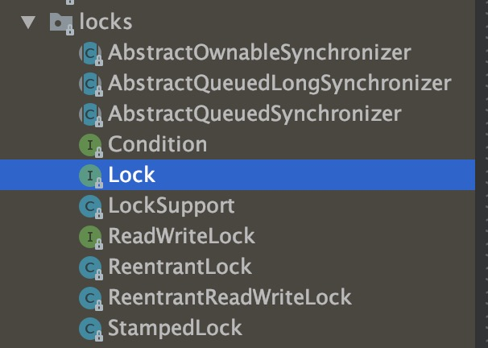

### 锁的种类

锁的种类很多，包括：自旋锁(CAS)、阻塞锁、可重入锁、读写锁、互斥锁、悲观锁、乐观锁、公平锁、可中断锁等等，主要介绍下可重入锁、读写锁、可中断锁和公平锁。

#### 可重入锁

> 如果锁具备可重入性，则称作为可重入锁。synchronized和ReentrantLock都是可重入锁，可重入性在我看来实际上表明了锁的分配机制：基于线程的分配，而不是基于方法调用的分配。举比如说，当一个线程执行到method1 的synchronized方法时，而在method1中会调用另外一个synchronized方法method2，此时该线程不必重新去申请锁，而是可以直接执行方法method2。

#### 读写锁

> 读写锁将对一个资源的访问分成了2个锁，如文件，一个读锁和一个写锁。正因为有了读写锁，才使得多个线程之间的读操作不会发生冲突。ReadWriteLock就是读写锁，它是一个接口，ReentrantReadWriteLock实现了这个接口。可以通过readLock()获取读锁，通过writeLock()获取写锁。

#### 可中断锁

> 可中断锁，即可以中断的锁。在Java中，synchronized就不是可中断锁，而Lock是可中断锁。
> 如果某一线程A正在执行锁中的代码，另一线程B正在等待获取该锁，可能由于等待时间过长，线程B不想等待了，想先处理其他事情，我们可以让它中断自己或者在别的线程中中断它，这种就是可中断锁。
> Lock接口中的lockInterruptibly()方法就体现了Lock的可中断性。

#### 公平锁

> 公平锁即尽量以请求锁的顺序来获取锁。同时有多个线程在等待一个锁，当这个锁被释放时，等待时间最久的线程（最先请求的线程）会获得该锁，这种就是公平锁。
> 非公平锁即无法保证锁的获取是按照请求锁的顺序进行的，这样就可能导致某个或者一些线程永远获取不到锁。
> synchronized是非公平锁，它无法保证等待的线程获取锁的顺序。对于ReentrantLock和ReentrantReadWriteLock，默认情况下是非公平锁，但是可以设置为公平锁。

### synchronized和lock的用法

#### synchronized

synchronized是Java的关键字，当它用来修饰一个方法或者一个代码块的时候，能够保证在同一时刻最多只有一个线程执行该段代码，同时它还可以保证共享变量的内存可见性。

##### 修饰代码块

```
public void method(){
    synchronized (Object o){
        //
    }
}
```
> 作用于代码块，synchronized后跟括号，括号里是变量，每次只会有一个线程进入该代码块。

##### 修饰方法

```
public synchronized void method(){
    //
}
```

> 作用于方法时，一次只有一个线程进入该方法，其他线程此时想调用只能排队等候。

##### 修饰类

```
public static void menthed(){
    synchronized(Service.class) {
    }
}
```

> 如果线程进入，则线程在该类中所有操作不能进行，包括静态变量和静态方法，对于含有静态方法和静态变量的代码块的同步，通常使用这种方式。

#### Lock

java.util.concurrent.locks 包下有以下这些类：



ReetrantLock实现了Lock接口，ReadWriteLock是读写锁的接口，由ReentrantReadWriteLock实现。

##### Lock

```
public interface Lock {

    void lock();

    void lockInterruptibly() throws InterruptedException;

    boolean tryLock();

    boolean tryLock(long time, TimeUnit unit) throws InterruptedException;

    void unlock();

    Condition newCondition();
}
```

Lock接口中定义了这6个接口。

- lock():用来获取锁，如果锁已经被其他线程获取，则会处于等待状态。使用Lock则必须主动释放锁，发生异常也不会自动释放锁，所以要在try{}catch()中进行，finally中释放锁。
- lockInterruptibly():通过这个方法去获取锁时，如果线程正在等待获取锁，则这个线程能够响应中断，即中断线程的等待状态。
- tryLock():尝试获取锁，如果获取成功，则返回true，如果获取失败则返回false。这个方法会立即返回，拿不到锁也不会等待。
- tryLock(long time, TimeUnit unit):也是尝试获取锁，不过会有设定的等待时间。
- unlock():释放锁
- newCondition(): 创建一个Condition，Condition接口也提供了类似Object的监视器方法，与Lock配合可以实现等待/通知模式。

##### ReentrantLock

ReentrantLock 实现了Lock接口，是一个可重入锁，内部定义了公平锁和非公平锁，默认是非公平锁。

```
public class ReentrantLockTest {

    public static void main(String[] args) throws InterruptedException {

        ReentrantLock lock = new ReentrantLock();

        for (int i = 1; i <= 3; i++) {
            lock.lock();
        }

        for(int i=1;i<=3;i++){
            try {

            } finally {
                lock.unlock();
            }
        }
    }
}
```

> ReentrantLock 可以通过lock()方法加锁多次，在通过unlock()方法释放锁多次使得程序正常退出，所以ReentrantLocl是可重入锁。

- ReentrantLock和synchronized都是独占锁,只允许线程互斥的访问临界区。synchronized是隐式的，ReentrantLocl是显示的。
- ReentrantLock和synchronized都是可重入的。synchronized因为可重入因此可以放在被递归执行的方法上,且不用担心线程最后能否正确释放锁；而ReentrantLock在重入时要却确保重复获取锁的次数必须和重复释放锁的次数一样，否则可能导致其他线程无法获得该锁。

##### ReadWriteLock

```
public interface ReadWriteLock {
    Lock readLock();

    Lock writeLock();
}
```

ReadWriteLock是读写锁，定义了一个获取读锁，一个获取写锁的方法。如果有一个线程已经占用了读锁，则此时其他线程如果要申请写锁，则申请写锁的线程会一直等待释放读锁；如果有一个线程已经占用了写锁，则此时其他线程如果申请写锁或者读锁，则申请的线程会一直等待释放写锁。

#### synchronized和lock的区别

- Lock是一个接口，而synchronized是java中的关键字。
- synchronized在发生异常的时候会自动释放锁，而Lock在发生异常的时候仍需要手动去释放锁。
- Lock可以让等待的线程响应中断，而synchronized不可以，会是等待线程一直等待下去，直到获取锁。
- Lock可以知道是否获取到锁。
- ReadWriteLock可以提高多读的效率。


