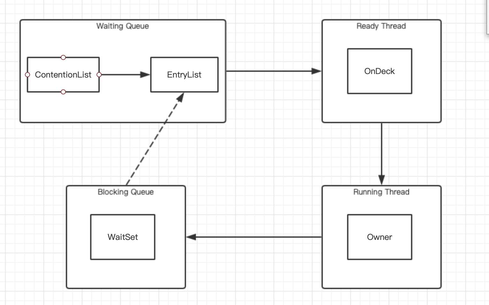
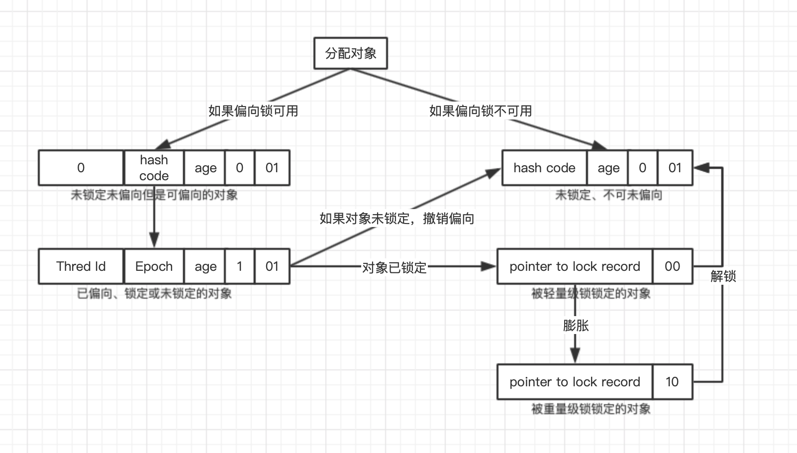

synchronized 可以使用任意一个非空的对象当做锁。synchronized属于独占式的悲观锁，也是可重入锁。它可以保证同一时刻只有一个线程执行某个方法或某个代码块，还可保证共享变量的可见性。

### synchronized的三种作用范围

- 作用于方法，锁住的是对象实例。
- 作用于代码块，指定加锁对象。
- 作用于静态方法，锁住的是class实例，相当于类的全局锁。

### java对象头和Monitor（来自深入理解java虚拟机）

在HotSpot虚拟机中，对象在内存中存储的布局可以分为3块区域：对象头（Header）、实例数据（Instance Data）和对齐填充（Padding）。

- 对象头：对象头主要包括两部分信息，第一部分用于存储对象自身的的运行时数据，如哈希码（HashCode）、GC分代年龄、锁状态表示、线程持有的锁、偏向线程ID、偏向时间戳等，这部分数据长度在32为和64为虚拟机中分别为32bit和64bit，简称Mark Word。对象头的另一部分是类型指针，即对象指向它的类元数据的指针，虚拟机通过这个指针来确定这个对象是哪个类的实例。如果对象是一个数组，在对象头还必须有一块用于记录数组长度的数据（1字节），这样虚拟机可以通过普通java对象的元数据信息确定java对象的大小。
    > 由于对象运行时的数据很多，已经超过了32/64位bit能记录的限度，但是对象头信息是与对象自身定义的数据无关的额外存储，考虑到虚拟机的空间效率，Mark Word被设计成一个非固定的数据结构以便在极小的空间存储尽量多的数据。
- 实例数据：这是对象真正存储的有效信息，就是代码中定义的各种字段内容（包括从父类继承的）。
- 对齐填充：这部分不是必然存在的，仅仅是占位符的作用，JVM 要求对象起始地址必须是8字节的整数倍。（对象大小必须是8字节的整数倍）

Mark Word 默认存储

| 锁状态 | 25bit | 4bit | 1bit是否是偏向锁 | 2bit锁标志位 |
| ----- | ----- | ---- | --------------- | ----------- |
| 无锁状态 | 对象HashCode | 对象分代年龄 | 0 | 01         |

可能变化的结构：

<table>
    <tr>
        <td rowspan="2">锁状态</td>
        <td colspan="2">25bit</td>
        <td rowspan="2">4bit</td>
        <td>1bit</td>
        <td>2bit</td>
    </tr>
	<tr>
		<td>23bit</td>
		<td>2bit</td>
		<td>是否是偏向锁</td>
		<td>锁标志位</td>
	</tr>
	<tr>
	    <td>轻量级锁</td>
	    <td rowspan="4">指向栈中锁记录的指针</td>
	    <td>00</td>
	</tr>
	<tr>
	    <td>重量级锁</td>
	    <td rowspan="4">指向重量级锁的指针</td>
	    <td>10</td>
	</tr>
	<tr>
	    <td>GC标记</td>
	    <td rowspan="4">空，不需要记录信息</td>
	    <td>11</td>
	</tr>
	<tr>
	    <td>偏向锁</td>
	    <td>偏向线程ID</td>
	    <td>偏向时间戳</td>
	    <td>对象分代年龄</td>
	    <td>1</td>
	    <td>01</td>
	</tr>
</table>

在锁标志位为10时，也就是代表重量级锁（synchronized），其中指针指向的是Monitor对象的起始地址。每个对象都与一个Monitor关联，对象和其Monitor之间有多种实现的方式（Monitor可以和对象一起创建销毁或获取锁对象的时候生成），但是当一个Monitor被某个线程持有便处于锁定状态。

> Monitor是由C++实现的，核心组件如下 ：
> - WaitSet：调用wait的方法被阻塞的线程被放在这；
> - ContentionList：竞争队列，所有请求锁的线程被先放在这个队列；
> - EntryList：Contention中资格成功候选资源的线程被放入这；
> - OnDeck：任意时刻，只有一个线程正在竞争锁，该线程就是OnDeck；
> - Owner：当前获取到锁资源的线程被称为Owner；
> - !Owner：当前释放锁的线程；

### synchronized原理

对于同步方法，JVM采用ACC_SYNCHRONIZED标记符来实现；对于同步代码块，JVM采用monitorenter、monitorexit来实现。

- 方法级同步是隐式的。同步方法的常量池中会有一个ACC_SYNCHRONIZED标识，当某个线程访问某方法的时候，会先检查有没有ACC_SYNCHRONIZED标识，如果有的话，需要去获取监视器锁，然后开始执行方法，执行完之后释放锁。此时如果有其他线程来执行，则会因为获取不到监视器锁而被阻塞。
- 可以把执行monitorenter指令理解为加锁，执行monitorexit理解为释放锁。 每个对象维护着一个记录着被锁次数的计数器。未被锁定的对象的该计数器为0，当一个线程获得锁（执行monitorenter）后，该计数器自增变为 1 ，当同一个线程再次获得该对象的锁的时候，计数器再次自增。当同一个线程释放锁（执行monitorexit指令）的时候，计数器再自减。当计数器为0的时候。锁将被释放，其他线程便可以获得锁。



1. JVM每次从队列尾部取出一个数据用于锁的竞争候选者（OnDeck），但是并发情况，ContentionList会被大量的并发线程进行CAS访问，为了降低对尾部元素的竞争，JVM会将一部分线程移动到EntryList中作为候选竞争线程。
2. Owner线程会在unlock时，将ContentionList中部分线程迁移到EntryList中，并制定EntryList中某个线程为OnDeck现场。（一般是最先进去的线程）
3. Owner线程不直接把锁传递给OnDeck线程，而是把锁竞争权利交给OnDeck，OnDeck需要重新竞争锁。这样虽然牺牲了公平性，但是可以极大提升系统的吞吐量。（这种行为成为竞争切换）
4. OnDeck线程获取到锁资源后会变为Owner线程，没有获取到锁资源的话会继续停留在EntryList中（仍是头部）。如果Owner线程为wait阻塞则会被转移到waitset队列，等到被notify或notifyAll唤醒，会重新进入EntryList。

> - 处于ContentionList、EntryList、WaitSet中的线程都是阻塞状态的。（由操作系统完成）
> - Synchronized是非公平锁。Synchronized在线程进入ContentionList时，等待的线程会先尝试获取锁，获取不到才进去ContentionList，自旋获取锁可能会直接抢占OnDeck线程的锁资源。

### Synchronized锁优化

高效并发是JDK1.5到JDK1.6的的一个重要改进，HotSpot团队实现来了很多锁优化的技术，例如适应性自旋、锁消除、锁粗化、轻量级锁和偏向锁。

> 无锁->偏向锁->轻量级锁->重量级锁，它会随着竞争情况逐渐升级。锁可以升级但不能降级，目的是为了提高获得锁和释放锁的效率。

#### 自旋锁与适应性自旋

互斥同步对性能影响最大的是阻塞的实现，挂起线程和恢复线程的操作都需要转入内核态来实现，这些操作会给内核系统的并发性带来很大的压力。同时虚拟机的团队注意到很多应用共享数据的锁定状态只会持续很短的一段时间，为了这段时间去挂起和恢复线程很不值得。如果物理机上有一个以上的处理器，能让两个或者以上的线程同时执行就可以让后面请求锁的那个线程稍等一下，不放弃处理器的执行时间，看看持有锁的线程是否很快会释放锁。为了让线程等待只需要让线程进行一个自旋，这就是自旋锁。
自旋锁在JDK1.4.2就被引入，默认是关闭的，可通过-XX:+UseSpinning参数开启，在JDK1.6中就改为默认开启了。自旋不能代替阻塞，自旋虽然避免了线程切换带来的开销，但是需要占用处理器的时间，如果占用处理的时间很长，那就白白消耗处理器的资源，反而性能被浪费。因此自旋等待时间有个限度，如果超过限度的自旋次数还没获取锁就去挂起线程。自旋的默认次数是10次，可使用-XX:PreBlockSpin来修改。
在JDK1.6中引入了自适应的自旋锁。自适应意味着自旋的时间不在固定，而是由前一次在同一个锁上的自旋时间以及锁的拥有者状态来决定。如果在同一个锁对象上，自旋等待刚刚成功获取过锁，并且持有锁的线程正在运行，那虚拟机会认为这次自旋也有可能再次获取成功，进而它的允许自旋等待时间将会更长。如果对于某个锁，自旋很少成功获取过，那么在以后要获取这个锁时将可能省略掉自旋过程，以避免浪费处理器的资源。

#### 锁消除

锁消除是指虚拟机即时编译器运行时，对一些代码上要求同步，但是被检测到不可能存在共享数据竞争的锁进行消除。锁消除主要判定依据来源于逃逸分析的数据支持，如果判断在一段代码中，堆上的所有数据均不会逃逸到出去从而被其他线程访问到，那就可以吧他们当做展示数据对待，认为它们是线程私有的，同步加锁自然无需执行。

锁消除主要是由于很多同步措施不是我们自己加入的，同步的代码在java程序中的普遍程度超过了大多数人的想象。如下代码无论从源码字面还是程序语义上都没有同步。

```
public String concatString(String s1, String s2, String s3) {
    return s1 + s2 + s3;
}
```

由于String是不可变的类，对字符串的连接操作总是通过生成新的String对象来进行，因此Javac编译器会对String连接做字段优化。所以上述代码可能会被优化为如下:

```
public String concatString(String s1, String s2, String s3) {
    StringBuffer sb = new StringBuffer();
    sb.append(s1);
    sb.append(s2);
    sb.append(s3);
    return sb.toString();
}
```

每个StringBuffer.append()方法中都有一个同步块，锁就是sb对象，如果虚拟机发现它的动态作用域被限制在concatString()方法的内部。sb的所有引用不会逃逸到concatString()方法的外部，其他线程也不会访问到它。因此虽然这里有锁，但是可以被安全的消除，在即时编译红藕，这段代码就会忽略掉所有的同步而直接执行。

#### 锁粗化

原则上，在编写代码的时候，推荐将同步快的作用范围限制的很小，只在共享数据的实际作用域中才进行同步，这样为了使得同步的操作数据尽可能的小，如果存在竞争，那等待锁的线程也可以尽快拿到锁。
如果一系列连续操作都对同一对象反复加锁和解锁，甚至加锁操作出现在循环体中，即便没有线程竞争也会造成不必要的性能消耗。
例如
```
public String concatString(String s1, String s2, String s3) {
    StringBuffer sb = new StringBuffer();
    sb.append(s1);
    sb.append(s2);
    sb.append(s3);
    return sb.toString();
}
```
上述代码就是这种情况，虚拟机检测到这样的零碎操作都对同一对象加锁，则会把加锁同步的范围扩大道整个操作序列的外部，这样只需要加锁一次即可。

#### 轻量级锁

轻量级锁是相对于使用操作系统互斥量来实现的传统锁而言，轻量级锁不是来代替重量级锁，而是在没有多线程竞争的前提下减少传统的重量级锁使用操作系统的互斥量产生的性能消耗。

加锁过程如下：

- 在代码进入同步块的时候，如果同步对象锁状态为无锁状态（锁标志位为“01”状态，是否为偏向锁为“0”），虚拟机首先将在当前线程的栈帧中建立一个名为锁记录（Lock Record）的空间，用于存储锁对象目前的Mark Word的拷贝，官方称之为 Displaced Mark Word。

- 拷贝对象头中的Mark Word复制到锁记录（Lock Record）中；

- 拷贝成功后，虚拟机将使用CAS操作尝试将锁对象的Mark Word更新为指向Lock Record的指针，并将线程栈帧中的Lock Record里的owner指针指向Object的 Mark Word。

- 如果这个更新动作成功了，那么这个线程就拥有了该对象的锁，并且对象Mark Word的锁标志位设置为“00”，即表示此对象处于轻量级锁定状态，这时候线程堆栈与对象头的状态如图所示。

- 如果这个更新操作失败了，虚拟机首先会检查对象的Mark Word是否指向当前线程的栈帧，如果是就说明当前线程已经拥有了这个对象的锁，那就可以直接进入同步块继续执行。否则说明多个线程竞争锁，轻量级锁就要膨胀为重量级锁，锁标志的状态值变为“10”，Mark Word中存储的就是指向重量级锁（互斥量）的指针，后面等待锁的线程也要进入阻塞状态。

#### 偏向锁

偏向锁的目的是消除数据在无竞争情况下的同步原语，如果轻量级锁是在无竞争情况下使用CAS操作去消除同步使用的互斥量，那偏向锁就是无竞争情况下吧整个同步都消除，CAS操作也不需要。

偏向锁意思是这个锁会偏向于第一个获取它的线程，如果在接下来的过程中，该锁没有被其他线程获取，则持有偏向锁的线程将永远不需要进行同步。

当锁对象第一次被线程获取到的时候，虚拟机将会吧对象头中的标志位设为01，即偏向模式，同时使用CAS操作将获取到这个锁的线程ID记录到对象的Mark Word中，如果CAS成功，持有偏向锁的线程以后每次即进入这个锁相关的同步块时，虚拟机可以不进行任何同步操作。

当有另外一个线程尝试获取这个锁时，偏向锁就结束了。根据对象目前是否处于被锁定状态，撤销偏向后恢复到未锁定或轻量级锁的状态。



锁偏向可以提高带有同步但无竞争的程序性能。但是程序中大多数锁总是被多个不同的线程访问，那偏向模式则是多余的，可以通过-XX:UseBiasedLocking来禁止偏向锁优化。
