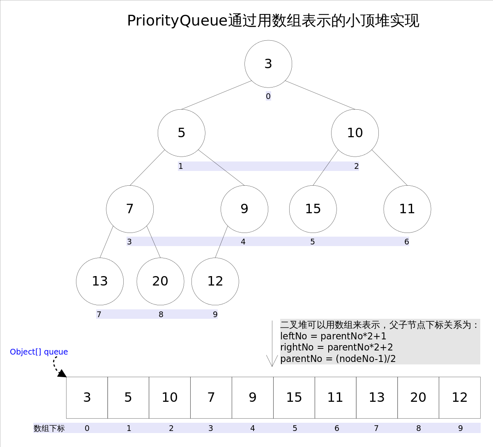

### PriorityQueue

PriorityQueue是一个优先队列，优先队列不允许空值，而且不支持non-comparable的对象（自定义的对象）。

优先队列的使用比较简单，常用的方法如下：

- peek()//返回队首元素
- poll()//返回队首元素，队首元素出队列
- add()/offer()//添加元素
- size()//返回队列元素个数
- isEmpty()//判断队列是否为空，为空返回true,不空返回false

优先对列通过小顶堆来实现，可以用一个完全二叉树来表示（任意一个非叶子节点的权值，都不大于其左右子节点的权值）。



一般通过add方法来添加元素：
```
public boolean add(E e) {
    return offer(e);
}
```

add方法其实也是调用了offer：
```
public boolean offer(E e) {
    if (e == null)
        throw new NullPointerException();
    modCount++;
    int i = size;
    if (i >= queue.length)
        grow(i + 1);//扩容
    size = i + 1;
    if (i == 0)
        queue[0] = e;
    else
        siftUp(i, e);//加入树
    return true;
}
```

offer方法比较简单，不允许元素为空，如果超过现在数组的长度就进行扩容，如果是第一个元素，将数组第一个（根结点）设为此元素，否则进行调整加入完全二叉树。

```
private void grow(int minCapacity) {
    int oldCapacity = queue.length;
    // Double size if small; else grow by 50%
    int newCapacity = oldCapacity + ((oldCapacity < 64) ?
                                     (oldCapacity + 2) :
                                     (oldCapacity >> 1));
    // overflow-conscious code
    if (newCapacity - MAX_ARRAY_SIZE > 0)
        newCapacity = hugeCapacity(minCapacity);
    queue = Arrays.copyOf(queue, newCapacity);
}
```
扩容方法就是申请一个更大的数组，将原来数组复制过去，所以可以看出是线程不安全的。

```
private void siftUp(int k, E x) {
    if (comparator != null)
        siftUpUsingComparator(k, x);
    else
        siftUpComparable(k, x);
}
private void siftUpUsingComparator(int k, E x) {
    while (k > 0) {
        int parent = (k - 1) >>> 1;
        Object e = queue[parent];
        if (comparator.compare(x, (E) e) >= 0)
            break;
        queue[k] = e;
        k = parent;
    }
    queue[k] = x;
}
private void siftUpComparable(int k, E x) {
    Comparable<? super E> key = (Comparable<? super E>) x;
    while (k > 0) {
        int parent = (k - 1) >>> 1;
        Object e = queue[parent];
        if (key.compareTo((E) e) >= 0)
            break;
        queue[k] = e;
        k = parent;
    }
    queue[k] = key;
}
```
将此节点加入树的过程，就是调用默认的比较方法或者传入的比较方法去和父节点比较，如果小于，那就和parent交换位置。
过程如下：


我们通过poll方法返回第一个对象并移除：
```
public E poll() {
    if (size == 0)
        return null;
    int s = --size;
    modCount++;
    E result = (E) queue[0];
    E x = (E) queue[s];
    queue[s] = null;
    if (s != 0)
        siftDown(0, x);//调整
    return result;
}
private void siftDown(int k, E x) {
    if (comparator != null)
        siftDownUsingComparator(k, x);
    else
        siftDownComparable(k, x);
}

private void siftDownComparable(int k, E x) {
    Comparable<? super E> key = (Comparable<? super E>)x;
    int half = size >>> 1;        // loop while a non-leaf
    while (k < half) {
        int child = (k << 1) + 1; // 左节点
        Object c = queue[child];
        int right = child + 1;//右节点
        if (right < size &&
            ((Comparable<? super E>) c).compareTo((E) queue[right]) > 0)
            c = queue[child = right];//找到更小的那个
        if (key.compareTo((E) c) <= 0)
            break;
        queue[k] = c;//替换
        k = child;
    }
    queue[k] = key;
}

private void siftDownUsingComparator(int k, E x) {
    int half = size >>> 1;
    while (k < half) {
        int child = (k << 1) + 1;
        Object c = queue[child];
        int right = child + 1;
        if (right < size &&
            comparator.compare((E) c, (E) queue[right]) > 0)
            c = queue[child = right];
        if (comparator.compare(x, (E) c) <= 0)
            break;
        queue[k] = c;
        k = child;
    }
    queue[k] = x;
}
```

将根节点删除的过程，找到根节点左右孩子中最小的那个，然后和最后一个节点比较，如果大于等于最后一个节点，此节点替换根节点，递归调用即可。
