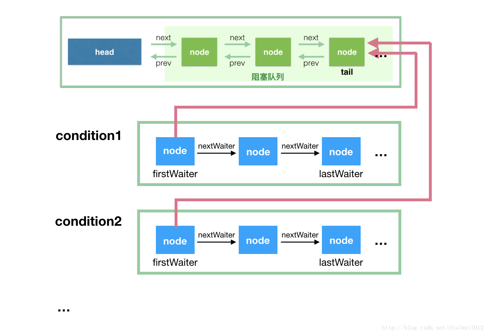
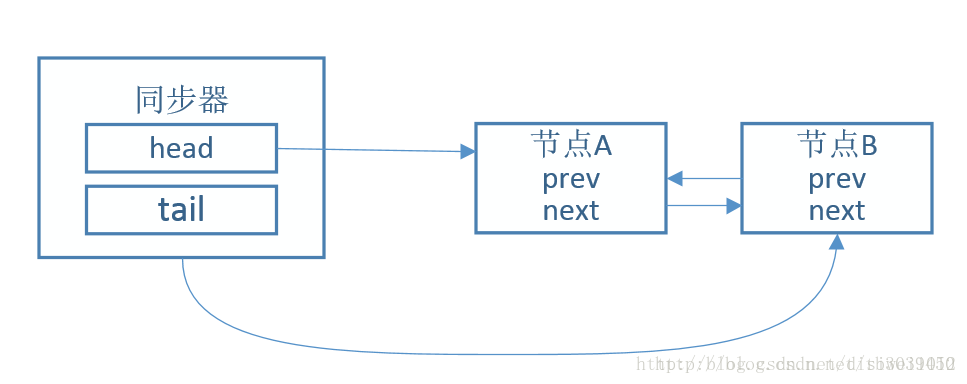
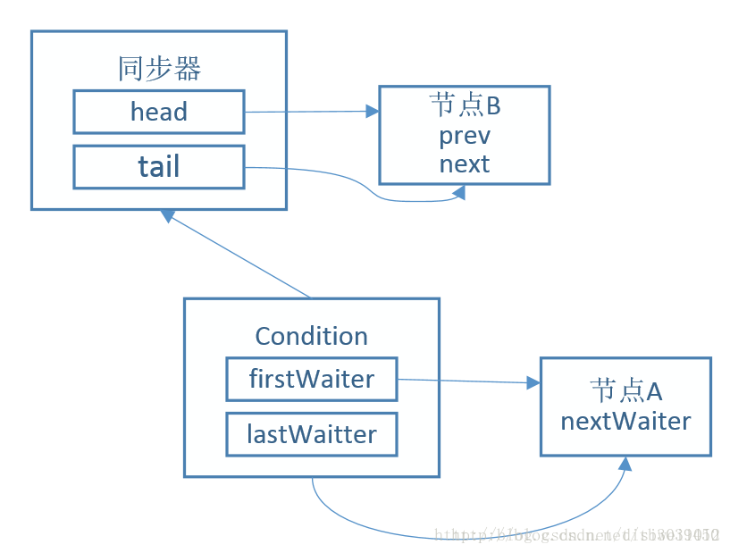
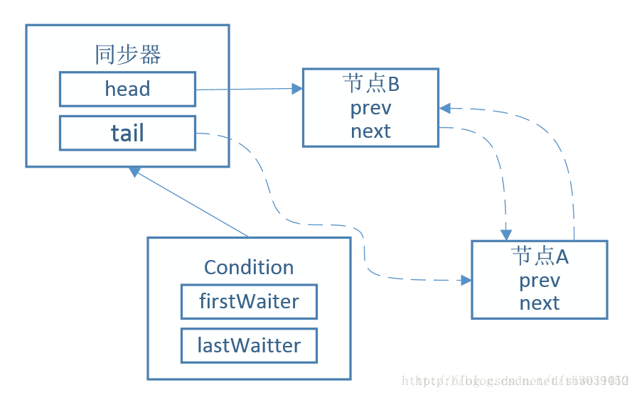

---
title: aqs源码 
date: 2019-11-18 21:33:08
comments: false
tags: 
- java
- aqs
- AbstractQueuedSynchronizer
- 锁
- 同步
categories: 
- java
keywords: 
- java
- aqs
- AbstractQueuedSynchronizer
- 锁
- 同步---

## aqs

AQS（AbstractQueuedSynchronizer）是JAVA中众多锁以及并发工具的基础，其底层采用乐观锁，大量使用了CAS操作， 并且在冲突时，采用自旋方式重试，以实现轻量级和高效地获取锁。

AQS虽然被定义为抽象类，但事实上它并不包含任何抽象方法。AQS是被设计为支持多种用途，如果定义抽象方法，子类在继承的时候就需要实现所有抽象方法，所以AQS将需要子类覆盖的方法都设计为protect方法，默认抛出UnsupportedOperationException异常，。如果子类用到这些方法就必须重写，否则会抛出异常，如果没有用到则不需要做任何操作。

AbstractQueuedSynchronizer只继承了AbstractOwnableSynchronizer，实现了java.io.Serializable接口。

> AbstractOwnableSynchronizer类是一种同步器，这个类仅有set和get独占线程资源。
> ```
> public abstract class AbstractOwnableSynchronizer
>      implements java.io.Serializable {
>  
>      private static final long serialVersionUID = 3737899427754241961L;
>  
>      protected AbstractOwnableSynchronizer() { }
>
>      private transient Thread exclusiveOwnerThread;
> 
>      protected final void setExclusiveOwnerThread(Thread t) {
>          exclusiveOwnerThread = t;
>      }
>
>      protected final Thread getExclusiveOwnerThread() {
>          return exclusiveOwnerThread;
>      }
>  }
> ```
> exclusiveOwnerThread 即独占资源的线程。

### AQS原理

AQS维护了一个state变量和node双向链表。

state是已获取资源占有许可的数量。例如线程调用acquire(1)获取资源的许可，acquire会调用一次tryAcquire(1)获取资源。如果获取成功，则state加1并且调用父类的设置独占线程将当前线程设置为独占线程。如果获取失败，则说明已经有线程占用了这个资源，需要等待占用释放。此时将该线程封装成node节点，加入双向链表，之后Locksupport.pack()堵塞当前线程。如果这个线程被唤醒则继续循环调用tryAcquire获取许可，如果获取到了将自己的node节点设置为链表的头结点并把之前的头结点去掉。如果线程释放资源，调用release方法，release方法会调用tryRelease方法尝试释放资源,如果释放成功，则state减1，再调用AQS的父类AbstractOwnableSynchronizer的设置独占线程为null，再locksupport.unpack()双向node链表的头node节点的线程，恢复其执行。

### 源码

#### 成员变量

```
private transient volatile Node head;

private transient volatile Node tail;

private volatile int state;

private static final Unsafe unsafe = Unsafe.getUnsafe();

private static final long stateOffset;
private static final long headOffset;
private static final long tailOffset;
private static final long waitStatusOffset;
private static final long nextOffset;

static {
    try {
        stateOffset = unsafe.objectFieldOffset
            (AbstractQueuedSynchronizer.class.getDeclaredField("state"));
        headOffset = unsafe.objectFieldOffset
            (AbstractQueuedSynchronizer.class.getDeclaredField("head"));
        tailOffset = unsafe.objectFieldOffset
            (AbstractQueuedSynchronizer.class.getDeclaredField("tail"));
        waitStatusOffset = unsafe.objectFieldOffset
            (Node.class.getDeclaredField("waitStatus"));
        nextOffset = unsafe.objectFieldOffset
            (Node.class.getDeclaredField("next"));

    } catch (Exception ex) { throw new Error(ex); }
}
```

有一个头尾节点和state变量，实现CAS的Unsafe的工具类，还有一些偏移量，都用于Unsafe的CAS操作，通过静态代码块进行初始化，通过objectFieldOffset获取对应字段相对于该对象的起始地址的偏移量。

#### Node节点

```
static final class Node {
    //共享模式
    static final Node SHARED = new Node();
    //独占模式
    static final Node EXCLUSIVE = null;
    //当线程等待超时或者被中断，则取消等待
    static final int CANCELLED =  1;
    //后继节点处于等待状态，当前节点（为-1）被取消或者中断时会通知后继节点，使后继节点的线程得以运行
    static final int SIGNAL    = -1;
    //当前节点处于等待队列，节点线程等待在Condition上，当其他线程对condition执行signall方法时，等待队列转移到同步队列，加入到对同步状态的获取。
    static final int CONDITION = -2;
    //与共享模式相关，在共享模式中，该状态标识结点的线程处于可运行状态。
    static final int PROPAGATE = -3;
    //状态
    volatile int waitStatus;
    //上一个节点
    volatile Node prev;
    //下一个节点
    volatile Node next;
    //节点所代表的线程
    volatile Thread thread;
    //Node既可以作为同步队列节点使用，也可以作为Condition的等待队列节点使用
    Node nextWaiter;

    final boolean isShared() {
        return nextWaiter == SHARED;
    }

    final Node predecessor() throws NullPointerException {
        Node p = prev;
        if (p == null)
            throw new NullPointerException();
        else
            return p;
    }

    Node() {    // Used to establish initial head or SHARED marker
    }

    Node(Thread thread, Node mode) {     // Used by addWaiter
        this.nextWaiter = mode;
        this.thread = thread;
    }

    Node(Thread thread, int waitStatus) { // Used by Condition
        this.waitStatus = waitStatus;
        this.thread = thread;
    }
}
```

#### enq方法

```
private Node enq(final Node node) {
   for (;;) {
       Node t = tail;
       if (t == null) { // Must initialize
           if (compareAndSetHead(new Node()))
               tail = head;
       } else {
           node.prev = t;
           if (compareAndSetTail(t, node)) {
               t.next = node;
               return t;
           }
       }
   }
}
```

enq方法是将node加入链表，如果tail尾节点为空则必须进行初始化，如果tail不为空，则将node的前指针指向tail，通过CAS将tail的指向改为node，然后设置t.next为node，完成node插入链表尾部。

#### addWaiter方法

```
private Node addWaiter(Node mode) {
    Node node = new Node(Thread.currentThread(), mode);
    // Try the fast path of enq; backup to full enq on failure
    Node pred = tail;
    if (pred != null) {
        node.prev = pred;
        if (compareAndSetTail(pred, node)) {
            pred.next = node;
            return node;
        }
    }
    enq(node);
    return node;
}
```
addWaiter方法包装node节点，放入node双向链表。如果tail不为空则说明初始化过了直接将node加入链表尾部，如果为空则进行初始化再将node加入链表尾部。

#### 共享模式

##### acquireShared（获取锁）

```
public final void acquireShared(int arg) {
    if (tryAcquireShared(arg) < 0)
        doAcquireShared(arg);
}
```

尝试去获取资源，如果没有获取资源返回负数，tryAcquireShared方法需要子类自己去实现，如果不实现会直接抛异常（在读写锁的Sync实现）；如果没有获取到资源加入等待队列等待获取资源。

##### doAcquireShared

```
private void doAcquireShared(int arg) {
    final Node node = addWaiter(Node.SHARED);
    boolean failed = true;
    try {
        boolean interrupted = false;
        for (;;) {
            //找先驱结点
            final Node p = node.predecessor();
            if (p == head) {
                //尝试获取资源
                int r = tryAcquireShared(arg);
                if (r >= 0) {
                    //获取锁之后，设置当前节点为头节点，去唤醒
                    setHeadAndPropagate(node, r);
                    p.next = null; // help GC
                    //如果是因为中断醒来则设置中断标记位
                    if (interrupted)
                        selfInterrupt();
                    failed = false;
                    return;
                }
            }
            //挂起
            if (shouldParkAfterFailedAcquire(p, node) &&
                parkAndCheckInterrupt())
                interrupted = true;
        }
    } finally {
        // 获取锁失败
        if (failed)
            cancelAcquire(node);
    }
}
```

先吧当前节点加入到队列尾部，然后进入自旋，自旋的目的是为了获取资源或者阻塞，如果此节点的前一个node是head节点，就去获取资源，如果获取失败就执行shouldParkAfterFailedAcquire，将前一个node设置为SIGNAL，获取成功就setHeadAndPropagate。

###### setHeadAndPropagate

```
//两个入参，一个是当前成功获取共享锁的节点，一个就是tryAcquireShared方法的返回值，它可能大于0也可能等于0
private void setHeadAndPropagate(Node node, int propagate) {
    Node h = head; // Record old head for check below
    //设置新的头节点
    setHead(node);
    //propagate > 0 代表还有资源，还可以继续唤醒  | h.waitStatus 是 -1 or -3
    if (propagate > 0 || h == null || h.waitStatus < 0) {
        Node s = node.next;
        //如果当前节点的后继节点是共享类型获取没有后继节点，则进行唤醒
        if (s == null || s.isShared())
            doReleaseShared();
    }
}
```

> 会唤醒后面的所有节点

###### doReleaseShared（唤醒）
```
private void doReleaseShared() {
    for (;;) {
        //从头结点开始 head已是上面设置的head节点
        Node h = head;
        if (h != null && h != tail) {
            int ws = h.waitStatus;
            //表示需要唤醒（-1）
            if (ws == Node.SIGNAL) {
                //CAS 将状态置为0
                if (!compareAndSetWaitStatus(h, Node.SIGNAL, 0))
                    continue;            // loop to recheck cases
                //唤醒
                unparkSuccessor(h);
            }
            //如果后继节点暂时不需要唤醒，则把当前节点状态设置为PROPAGATE确保以后可以传递下去
            else if (ws == 0 &&
                     !compareAndSetWaitStatus(h, 0, Node.PROPAGATE))
                continue;                // loop on failed CAS
        }
        //如果头结点没有发生变化，表示设置完成，退出循环
        //如果头结点发生变化，比如说其他线程获取到了锁，为了使自己的唤醒动作可以传递，必须进行重试
        if (h == head)                   // loop if head changed
            break;
    }
}
```

###### unparkSuccessor方法

```
 private void unparkSuccessor(Node node) {
    int ws = node.waitStatus;
    if (ws < 0)
        compareAndSetWaitStatus(node, ws, 0);

    Node s = node.next;
    //next 节点为空 或者状态为取消
    if (s == null || s.waitStatus > 0) {
        s = null;
        //从后向前找
        for (Node t = tail; t != null && t != node; t = t.prev)
            if (t.waitStatus <= 0)
                s = t;
    }
    if (s != null)
        LockSupport.unpark(s.thread);
}
```

用unpark()唤醒等待队列中最前边的那个未放弃线程，node的waitStatus为signal或condition，则可以唤醒，先重置node的waitStatus为0（允许失败），找到下一个需要唤醒的节点唤醒。

> 从后往前找是因为下一个任务有可能被取消了，节点就有可能为null

###### shouldParkAfterFailedAcquire

```
private static boolean shouldParkAfterFailedAcquire(Node pred, Node node) {
    int ws = pred.waitStatus;
    if (ws == Node.SIGNAL)
        return true;
    if (ws > 0) {
        do {
            node.prev = pred = pred.prev;
        } while (pred.waitStatus > 0);
        pred.next = node;
    } else {
        compareAndSetWaitStatus(pred, ws, Node.SIGNAL);
    }
    return false;
}
```

> 主要是进行的状态的检查，如果前一个节点的状态是-1则返回true；如果前一个节点取消了，那就向前找到一个没有被取消的节点，将取消的节点舍弃，如果前一个节点没有被取消则将节点状态设置为-1.

##### releaseShared（ 释放锁）

```
public final boolean releaseShared(int arg) {
    if (tryReleaseShared(arg)) {
            doReleaseShared();
        return true;
    }
    return false;
}
```

#### 独占模式

##### acquire（获取锁）
```
public final void acquire(int arg) {
    if (!tryAcquire(arg) &&
        acquireQueued(addWaiter(Node.EXCLUSIVE), arg))
        selfInterrupt();
}
```
首先也是尝试获取资源，如果获取到资源则直接返回了，如果没有获取到资源则执行acquireQueued(addWaiter(Node.EXCLUSIVE), arg)，将该线程加入队列节点尾部。

##### acquireQueued
```
final boolean acquireQueued(final Node node, int arg) {
    boolean failed = true;
    try {
        boolean interrupted = false;
        for (;;) {
            final Node p = node.predecessor();
            if (p == head && tryAcquire(arg)) {
                setHead(node);
                p.next = null; // help GC
                failed = false;
                return interrupted;
            }
            if (shouldParkAfterFailedAcquire(p, node) &&
                parkAndCheckInterrupt())
                interrupted = true;
        }
    } finally {
        if (failed)
            cancelAcquire(node);
    }
}
```

和共享模式类似，先获取该节点的前一个节点，如果前一个节点是头结点就尝试获取资源。如果获取到资源则把这个接地点设为头节点 直接返回了；如果没有获取到资源则进入阻塞挂起。

> 挂起逻辑同上。

##### cancelAcquire

```
private void cancelAcquire(Node node) {
    //如果节点不存在直接返回
    if (node == null)
        return;
    node.thread = null;

    Node pred = node.prev;
    //跳过前面已经取消的前置节点
    while (pred.waitStatus > 0)
        node.prev = pred = pred.prev;
    Node predNext = pred.next;
    //将node的状态设置为1 其他节点在处理时就可以跳过
    node.waitStatus = Node.CANCELLED;
    //如果是尾节点直接删除返回
    if (node == tail && compareAndSetTail(node, pred)) {
        compareAndSetNext(pred, predNext, null);
    } else {
        int ws;
        //否则当前节点的前置节点不是头节点且它后面的节点等待它唤醒
        if (pred != head &&
            ((ws = pred.waitStatus) == Node.SIGNAL ||
             (ws <= 0 && compareAndSetWaitStatus(pred, ws, Node.SIGNAL))) &&
            pred.thread != null) {
            Node next = node.next;
            if (next != null && next.waitStatus <= 0)
                //删除该node
                compareAndSetNext(pred, predNext, next);
        } else {
            //要么当前节点的前置节点是头结点,直接唤醒当前节点的后继节点
            unparkSuccessor(node);
        }
        node.next = node; // help GC
    }
}
```

获取锁资源失败的处理，即自己实现的获取资源的逻辑出异常的时候会进入到这里。（共享模式同这里的）

##### release（释放锁）

```
public final boolean release(int arg) {
    if (tryRelease(arg)) {
        Node h = head;
        if (h != null && h.waitStatus != 0)
            unparkSuccessor(h);
        return true;
    }
    return false;
}

private void unparkSuccessor(Node node) {
    int ws = node.waitStatus;
    if (ws < 0)
        compareAndSetWaitStatus(node, ws, 0);

    Node s = node.next;
    if (s == null || s.waitStatus > 0) {
        s = null;
        for (Node t = tail; t != null && t != node; t = t.prev)
            if (t.waitStatus <= 0)
                s = t;
    }
    if (s != null)
        LockSupport.unpark(s.thread);
}
```

#### 条件队列(ConditionObject)

使用场景
```
//首先创建一个可重入锁，它本质是独占锁
private final ReentrantLock takeLock = new ReentrantLock();
//创建该锁上的条件队列
private final Condition notEmpty = takeLock.newCondition();
//使用过程
public E take() throws InterruptedException {
    //首先进行加锁
    takeLock.lockInterruptibly();
    try {
        //如果队列是空的，则进行等待
        notEmpty.await();
        //取元素的操作...
        
        //如果有剩余，则唤醒等待元素的线程
        notEmpty.signal();
    } finally {
        //释放锁
        takeLock.unlock();
    }
    //取完元素以后唤醒等待放入元素的线程
}
```

Condition一般都是配合一个显式锁Lock一起使用，Lock接口的方法中有一个newCondition()方法用于生成Condition对象。
通过ReentrantLock的lock方法，如果获取不到锁当前线程会进入AQS队列阻塞；被唤醒后继续获取锁，如果获取到锁，移出AQS队列，继续执行；遇到Condition的await方法，加入“条件队列”，阻塞线程；被其他线程的signal方法唤醒，从“条件队列”中删除，并加入到AQS队列，如果获取到锁就继续执行。可以看到上述操作，线程节点（Node）其实在两个队列之间切换，由于“条件队列”在被唤醒时 都是从头开始遍历，所以只需要使用单向链表实现即可。

```
public interface Condition {

    void await() throws InterruptedException;

    void awaitUninterruptibly();

    long awaitNanos(long nanosTimeout) throws InterruptedException;

    boolean await(long time, TimeUnit unit) throws InterruptedException;

    boolean awaitUntil(Date deadline) throws InterruptedException;

    void signal();

    void signalAll();
}
```

ConditionObject 实现了 Condition接口，Condition接口中一个有7个接口：

- await : 使用这个锁必须放在一个显式锁的lock和unlock之间，调用该方法后当前线程会释放锁并被阻塞，直到其他线程通过调用同一个Condition对象的signal或者signalAll方法或被中断，再次被唤醒。（可被中断）
- awaitUninterruptibly : 此方式是不可被中断的，只能通过其他线程调用同一个Condition对象的signal或者signalAll方法，才能被唤醒。（不响应中断）
- awaitNanos : 等待纳秒时间
- await(long time, TimeUnit unit) : 等待一个指定时间
- awaitUntil : 等待直到一个截止时间
- signal : 唤醒等待队列中的第一个节点
- signalAll : 唤醒等待队列中的所有节点

##### await 

```
public final void await() throws InterruptedException {
    if (Thread.interrupted())
        throw new InterruptedException();
    //加入条件队列
    Node node = addConditionWaiter();
    //释放当前线程占用的排它锁  
    int savedState = fullyRelease(node);
    int interruptMode = 0;
    //节点不在AQS的阻塞队列中
    while (!isOnSyncQueue(node)) {
        //阻塞该线程
        LockSupport.park(this);
        //判断中断标记在阻塞等待期间 是否改变  
        if ((interruptMode = checkInterruptWhileWaiting(node)) != 0)
            break;
    }
    //当被唤醒后，该线程会尝试去获取锁，只有获取到了才会从await()方法返回，否则的话，会挂起自己
    if (acquireQueued(node, savedState) && interruptMode != THROW_IE)
        interruptMode = REINTERRUPT;
    if (node.nextWaiter != null) // clean up if cancelled
        //清理取消节点对应的线程 
        unlinkCancelledWaiters();
    if (interruptMode != 0)
        //抛出中断异常，或者重新进入中断  
        reportInterruptAfterWait(interruptMode);
}
```

先将该节点加入到条件队列，然后释放掉当前的锁，如果该节点不在AQS的阻塞队列中就阻塞该线程，等待signal；被唤醒后该线程会尝试去获取锁

##### signal

```
public final void signal() {
    if (!isHeldExclusively())
        throw new IllegalMonitorStateException();
    //第一个节点
    Node first = firstWaiter;
    if (first != null)
        doSignal(first);
}

private void doSignal(Node first) {
    do {
        //firstWaiter 下一个节点
        if ( (firstWaiter = first.nextWaiter) == null)
            lastWaiter = null;
        first.nextWaiter = null;
    } while (!transferForSignal(first) &&
             (first = firstWaiter) != null);
}

final boolean transferForSignal(Node node) {
    //改变线程状态
    if (!compareAndSetWaitStatus(node, Node.CONDITION, 0))
        return false;
    //加入AQS阻塞队列
    Node p = enq(node);
    int ws = p.waitStatus;
    //唤醒
    if (ws > 0 || !compareAndSetWaitStatus(p, ws, Node.SIGNAL))
        LockSupport.unpark(node.thread);
    return true;
}
```

将条件队列的第一个节点移除，加入到AQS的阻塞队列中。

##### signalAll

```
public final void signalAll() {
    if (!isHeldExclusively())
        throw new IllegalMonitorStateException();
    Node first = firstWaiter;
    if (first != null)
        doSignalAll(first);
}

private void doSignalAll(Node first) {
    lastWaiter = firstWaiter = null;
    do {
        Node next = first.nextWaiter;
        first.nextWaiter = null;
        transferForSignal(first);
        first = next;
    } while (first != null);
}
```

signalAll 会遍历全部节点唤醒加入到AQS阻塞队列。

#### 条件队列与同步队列

1.同步队列依赖一个双向链表来完成同步状态的管理，当前线程获取同步状态失败 后，同步器会将线程构建成一个节点，并将其加入同步队列中。
2.通过signal或signalAll将条件队列中的节点转移到同步队列。（由条件队列转化为同步队列）



条件队列节点来源：

1. 调用await方法阻塞线程；
2. 当前线程存在于同步队列的头结点，调用await方法进行阻塞（从同步队列转化到条件队列）

例如：

1. 假设初始状态如下，节点A、节点B在同步队列中。



2. 节点A的线程获取锁权限，此时调用await方法。节点A从同步队列移除， 并加入条件队列中。



3. 调用 signal方法，从条件队列中取出第一个节点，并加入同步队列中，等待获取资源



