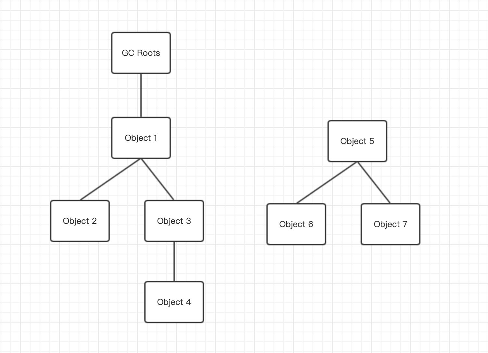
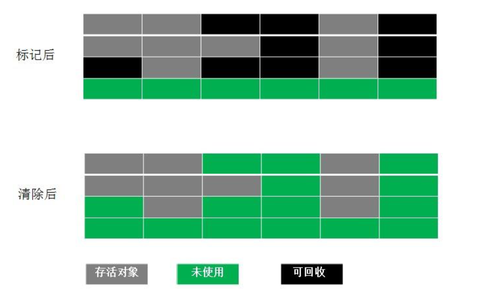
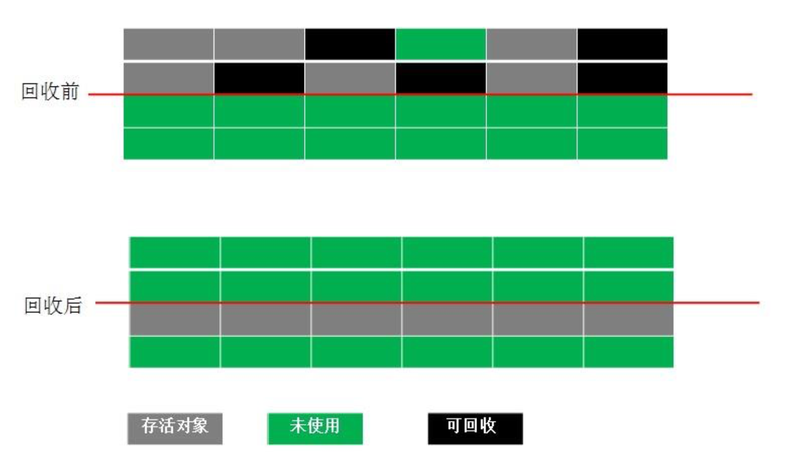
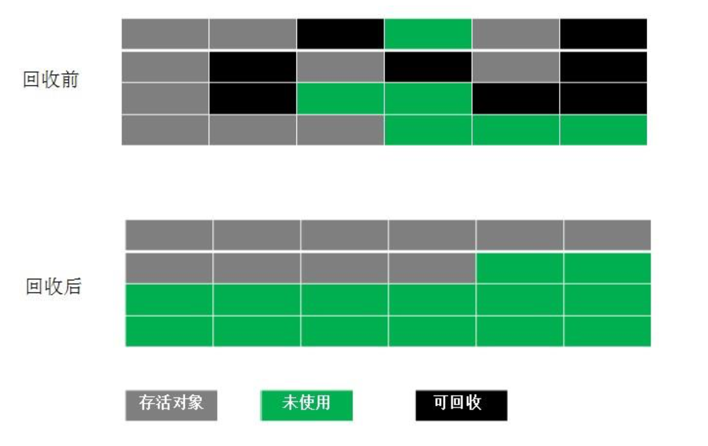

### 垃圾回收

在java运行过程中，程序计数器、虚拟机栈、本地方法栈3个区域都是线程私有的，都会随着线程而创建，随着线程而销毁。这三个区域不需要考虑内存的回收，在方法结束或者线程结束后，内存就会被回收。
但是在java堆和方法区却不能这样，只有在程序运行的过程中才能知道会创建哪些对象，这些对象的创建和回收都是动态的，因为这部分区域的内容是需要垃圾回收的。

#### 如何确定垃圾

##### 引用计数法

给对象添加一个引用计数器，每当有一个地方引用它时，计数器就+1；当引用失效的时候，计数器就-1；在任何时候，计数器为0的对象就是不可在被使用的，这个对象就是可回收对象。

> 引用计数法的实现很简单，判定效率也比较高，但是它无法解决对象之前相互引用的问题。

```
public class Test {
    public Object instance = null;
    public static void main(String[] args) {
        Test t1 = new Test();
        Test t2 = new Test();
        t1.instance = t2;
        t2.instance = t1;
        t1 = null;
        t2 = null;
    }
}
```

以上两个对象都已经为空且无任何引用，而且已经不可被访问，但是它们相互引用的对方，它们的引用计数器都不为0，使用引用计数法就无法进行回收内存。

##### 可达性分析

这个算法就是通过一系列 GC Roots的对象作为起点，从这些节点开始向下搜索，搜索走过的路径就是引用链，当一个对象到GC Roots没有任何引用链相连时，则证明此对象是不可用的。



像上图，对象o5-o6虽然互相有关联，但是到GC Roots都是不可达的，因此都会被判为可回收对象。

在java中，可被作为GC Roots对象的包括：
- 虚拟机栈中引用的对象。
- 方法区中类静态属性引用的对象。
- 方法区中常量引用的对象。
- 本地方法栈中JNI（Native）引用的对象。

##### java中的引用

Java中因为可分为强引用、软引用、弱引用、虚引用4种，这四种引用强度依次逐渐减弱。

- 强引用：强引用就是平时new 出来的对象的这类的引用，只要强引用存在，对象就不会被回收。
- 软引用：用来描述一些有用但是不是必须的对象。在系统要发生内存溢出之前，会将这些对象列入回收范围内进行第二次回收，如果还没有足够内存才会抛出异常。（SoftReference来实现）
- 弱引用：被弱引用关联的对象只能生存到下一次垃圾回收之前。（WeakReference来实现）
- 虚引用：为一个对象设置虚引用关联的唯一目的是能在这个对象被垃圾回收器回收时能得到一个系统通知。（PhantomReference来实现）

##### 垃圾的自救

被标记为不可用的对象也不会直接被回收，一个对象的回收至少要经历两次标记的过程。如果一个对象经过可达性分析后没有与GC Roots相连接的引用链，那就会被进行第一次标记并进行一个筛选，筛选的条件是这个对象是否有必要执行finalize方法。如果没有覆盖finalize方法或者finalize方法已经被执行过，这都没有必要执行。

如果这个对象有必要执行finalize方法，那这个对象会放在是一个F-Queue队列中，由虚拟机自动建立的、优先级低的Finalizer线程来执行，即这个方法会被触发，但是不保证会等待运行结束。如果对象在finalize方法中重新与引用链上的任何一个对象相关联，则在第二次标记时就会被移出即将回收的集合，否则就会被回收。

```
public class FinalizeGC {
    public static FinalizeGC gc = null;

    @Override
    protected void finalize() throws Throwable {
        System.out.println("finalize method executed");
        FinalizeGC.gc = this;
    }

    public static void main(String[] args) throws Exception {
        gc = new FinalizeGC();
        //第一次自救
        gc = null;
        System.gc();
        Thread.sleep(500);//优先级很低，等待执行下
        if(gc != null) {
            System.out.println("still alive");
        } else {
            System.out.println("dead");
        }

        //第二次
        gc = null;
        System.gc();
        Thread.sleep(500);
        if(gc != null) {
            System.out.println("still alive");
        } else {
            System.out.println("dead");
        }
    }
}
```

以上代码会输出

```
finalize method executed
still alive
dead
```

可以看出gc对象的finalize方法的确被执行过了，而且也自救了一次。

#### 垃圾回收算法

##### 标记-清除算法

标记-清除（Mark-Sweep）算法分为标记和清除两个阶段：首先标记出所有需要回收的对象，在标记完成后统一回收所有被标记的对象。（后续的收集算法都是基于这种思路并对其不足进行改造而得到的）

Mark-Sweeo的不足：
- 效率问题，标记和清除两个过程的效率都不高
- 空间问题，标记清除后会产生大量不连续的内存碎片，空间碎片太多可能导致以后在程序运行的过程中分配较大对象时，无法找到足够的连续内存而不得不提前触发另一次垃圾回收。



从上图可以看出在进行标记清除后，内存碎片化非常严重。

##### 复制算法

复制算法将可用容量划分为大小相等的两块，每次只使用其中的一块，当这一块内存用完了就将还存储着的对象复制到另外一块上面，然后再把已使用过的内存空间一次清理掉。这样每次都是对整个半区进行内存回收，内存分配也不需要考虑内存碎片的问题。
这种算法虽然实现简单，运行高效，只是代价是将内存缩小为原来的一半，代价太高了。

> 现在的商业虚拟机都采用这种回收算法来回收新生代，但是研究表明新生代中的对象98%是朝生夕死，所以不需要按1:1划分内存空间，而是将内存分为一块较大的Eden空间和两次较小的Survivor空间，每次使用Eden和其中一块Survivor空间。HotSpot默认Eden和Survivor大小比例是8:1（也就是只有百分10的空间会被浪费）。当Survivor空间不够用时，需要依赖其他内存（老年代）进行分配担保。



##### 标记-整理算法

复制算法在对象存活率较高时就要进行较多的复制操作，复制效率就会变低，老年代一般不直接使用复制算法。
根据老年代的特征，有人提出了标记整理算法，在对对象进行标记之后，让所有活的对象都想一端移动，然后直接清理掉边界以外的内存。



##### 分代收集算法

分代收集法是目前大部分JVM所采用的方法，其核心思想是根据对象存活的不同生命周期将内存划分为不同的域，一般情况下将GC堆划分为老生代和新生代。老生代的特点是每次垃圾回收时只有少量对象需要被回收，新生代的特点是每次垃圾回收时都有大量垃圾需要被回收，因此可以根据不同区域选择不同的算法。

###### 新生代与复制算法

目前大部分JVM的GC对于新生代都采取复制算法，因为新生代中每次垃圾回收都要回收大部分对象，即要复制的操作比较少，但通常并不是按照 1:1 来划分新生代。一般将新生代划分为一块较大的Eden空间和两个较小的Survivor空间(From Space, To Space)，每次使用Eden空间和其中的一块Survivor空间，当进行回收时，将该两块空间中还存活的对象复制到另一块Survivor空间中。

###### 老年代与标记复制算法

而老年代因为每次只回收少量对象，因而采用标记整理算法。

对象从新生代到老年代：
1. 当新生代的 Eden Space 和 From Space 空间不足时就会发生一次GC，进行GC后，Eden Space 和 From Space 区的存活对象会被挪到 To Space，然后将 Eden Space 和 From Space 进行清理。
2. 如果 To Space 无法足够存储某个对象，则将这个对象存储到老生代。
3. 在进行 GC 后，使用的便是 Eden Space 和 To Space 了，如此反复循环。
4. 当对象在 Survivor 区躲过一次 GC 后，其年龄就会+1。默认情况下年龄到达15的对象会被移到老生代中。
