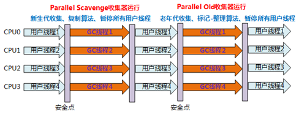

### 垃圾收集器

java虚拟机规范没有对垃圾收集器如何实现做任何规定，因此不同厂商、版本提供的垃圾收集器都不一样，JDK1.7中垃圾收集器如下:

如果两个收集器之间存在连线，则说明他们之间可以搭配使用。

#### Serial收集器（单线程复制算法）

这个收集器是一个单线程的收集器，但它单线程的意义不仅仅说明它只会使用一个CPU或一条收集线程去完成垃圾回收，它在进行垃圾回收的时，必须暂停其他所有工作线程，直到它收集完毕。

Serial收集器运行时如下：

当Serial收集器工作时候，会造成Stop-The-World，这对很多应用是不可能接受的。但是对于限定单个CPU的环境来说，没有线程交互的开销，专心做GC，和其他收集器相比是简单而高效的（单线程情况）。在用户的桌面应用场景中，可用内存一般不大（几十M至一两百M），可以在较短时间内完成垃圾收集（几十MS至一百多MS）,只要不频繁发生，这是可以接受的。因此，Serial收集器对于运行在Client模式下的虚拟机来说是个比较好的选择。

#### ParNew 收集器（Serial+多线程）

ParNew收集器其实就是Serial收集器的多线程版本，也使用复制算法，除了使用多线程进行垃圾收集之外，其余的行为和Serial收集器完全一样，ParNew垃圾收集器在垃圾收集过程中同样也要暂停所有其他的工作线程。
它是许多运行在Server模式下的虚拟机的首要选择，除了Serial收集器外，目前只有它能与CMS收集器配合工作。

> CMS收集器是一个被认为具有划时代意义的并发收集器，因此如果有一个垃圾收集器能和它一起搭配使用让其更加完美，那这个收集器必然也是一个不可或缺的部分了。

ParNew收集器的运行过程如下图所示:

在Server模式下，ParNew收集器是一个非常重要的收集器，因为除Serial外，目前只有它能与CMS收集器配合工作；但在单个CPU环境中，不会比Serail收集器有更好的效果，因为存在线程交互开销，该收集器通过超线程技术实现的两个CPU的环境中都不能百分百的保证超过Serial收集器。

#### Parallel Scavenge 收集器(多线程复制算法)

Parallel Scavenge收集器是一个新生代收集器，它也是使用复制算法的收集器，又是并行的多线程收集器。
Parallel Scavenge收集器的特点是它的关注点和其他收集器不同，CMS等收集器关注点是尽可能的缩短垃圾收集时用户的停顿时间，而Parallel Scavenge关注点是吞吐量（如何高效率的利用CPU）。所谓吞吐量就是CPU中用于运行用户代码的时间与CPU总消耗时间的比值。（吞吐量：CPU用于用户代码的时间/CPU总消耗时间的比值，即=运行用户代码的时间/(运行用户代码时间+垃圾收集时间)。比如，虚拟机总共运行了100分钟，其中垃圾收集花掉1分钟，那吞吐量就是99%。）

当应用程序运行在具有多个CPU上，对暂停时间没有特别高的要求时，即程序主要在后台进行计算，而不需要与用户进行太多交互，例如，那些执行批量处理、订单处理、工资支付、科学计算的应用程序；可以采用Parallel Scavenge收集器。

#### Serial Old收集器（单线程标记整理）

Serial收集器的老年代版本，同样是一个单线程收集器。

它主要有两大用途：一种用途是在JDK1.5以及以前的版本中与Parallel Scavenge收集器搭配使用，另一种用途是作为CMS收集器的后备方案

#### Parallel Old收集器（多线程标记整理）

Parallel Old 收集器是Parallel Scavenge的年老代版本，使用多线程的标记-整理算法，在JDK1.6才开始提供。
在JDK1.6之前，新生代使用ParallelScavenge收集器只能搭配年老代的Serial Old收集器，只能保证新生代的吞吐量优先，无法保证整体的吞吐量，Parallel Old 正是为了在年老代同样提供吞吐量优先的垃圾收集器，如果系统对吞吐量要求比较高，可以优先考虑新生代 Parallel Scavenge 和年老代 Parallel Old 收集器的搭配策略。

#### CMS收集器（多线程标记清除）

CMS 收集器是一种以获取最短回收时间为目标的收集器。它的整个过程分为4个步骤：初始标记、并发标记、重新标记、并发清除。

- 初始标记： 暂停所有的其他线程，初始标记仅仅标记GC Roots能直接关联到的对象，速度很快；
- 并发标记： 并发标记就是进行GC Roots Tracing的过程；同时开启GC和用户线程，用一个闭包结构去记录可达对象。但在这个阶段结束，这个闭包结构并不能保证包含当前所有的可达对象。因为用户线程可能会不断的更新引用域，所以GC线程无法保证可达性分析的实时性。所以这个算法里会跟踪记录这些发生引用更新的地方；
- 重新标记： 重新标记阶段就是为了修正并发标记期间因为用户程序继续运行而导致标记产生变动的那一部分对象的标记记录（采用多线程并行执行来提升效率）；需要"Stop The World"，且停顿时间比初始标记稍长，但远比并发标记短；
- 并发清除： 开启用户线程，同时GC线程开始对为标记的区域做清扫，回收所有的垃圾对象；

由于整个过程耗时最长的并发标记和并发清除过程收集器线程都可以与用户线程一起工作，所以总体来说，CMS的内存回收是与用户线程一起“并发”执行的。

CMS有三个明显的缺点；

1. 对CPU资源敏感：面向并发设计的程序都对CPU资源比较敏感（并发程序的特点）。在并发阶段，它虽然不会导致用户线程停顿，但会因为占用了一部分线程（或者说CPU资源）而导致应用程序变慢，总吞吐量会降低。
    > CMS的默认收集线程数量是=(CPU数量+3)/4；当CPU数量多于4个，收集线程占用的CPU资源多于25%，对用户程序影响可能较大；不足4个时，影响更大，可能无法接受。

2. 无法处理浮动垃圾：在并发清除时，用户线程新产生的垃圾，称为浮动垃圾；这使得并发清除时需要预留一定的内存空间，不能像其他收集器在老年代几乎填满再进行收集；也可以认为CMS所需要的空间比其他垃圾收集器大；
3. 产生大量内存碎片：由于CMS是基于“标记+清除”算法来回收老年代对象的，因此长时间运行后会产生大量的空间碎片问题，由于碎片过多，将会给大对象的分配带来麻烦。因此会出现这样的情况，老年代还有很多剩余的空间，但是找不到连续的空间来分配当前对象，这样不得不提前触发一次Full GC。。
    > 为了解决空间碎片问题，CMS收集器提供−XX:+UseCMSCompactAlFullCollection标志，使得CMS出现上面这种情况时不进行Full GC，而开启内存碎片的合并整理过程；但合并整理过程无法并发，停顿时间会变长；

#### G1收集器

G1是一款面向服务端应用的垃圾收集器。HotSpot开发团队赋予它的使命是未来可以替换JDK1.5发布的CMS收集器。与其他收集器相比，G1具备以下特点：

- 并行与并发：G1能充分利用CPU、多核环境下的硬件优势，使用多个CPU（CPU或者CPU核心）STW停顿时间。部分其他收集器原本需要停顿Java线程执行的GC动作，G1收集器仍然可以通过并发的方式让java程序继续执行。
- 分代收集：虽然G1可以不需要其他收集器配合就能独立管理整个GC堆，但它能够采用不同的方式去处理新创建的对象和已经存活了一段时间的对象，熬过多次GC的旧对象以获取更好的收集效果。
- 空间整合：与CMS的“标记–清理”算法不同，G1从整体来看是基于“标记整理”算法实现的收集器；从局部上来看是基于“复制”算法实现的。
- 可预测的停顿：这是G1相对于CMS的另一个大优势，降低停顿时间是G1和CMS共同的关注点，但G1除了追求低停顿外，还能建立可预测的停顿时间模型。可以明确指定M毫秒时间片内，垃圾收集消耗的时间不超过N毫秒。在低停顿的同时实现高吞吐量。

> G1收集器将整个java堆分为多个大小相等的独立区域（Region），虽然还保留了新生代和老年代的概念，但是新生代和老年代不是物理隔离，它们都是一部分Region的集合。

> G1收集器可以有计划的避免在整个java堆进行全局的垃圾回收。G1跟踪各个Region里面的垃圾堆积的价值大小（回收所获得的空间大小以及回收所需要的时间的经验值），在后台维护一个优先列表，每次根据允许的收集时间，优先回收价值最大的Region。这就保证了在有限的时间内可以获取尽可能高的收集效率。因此G1是可预测停顿的。

一个Region不可能是孤立的，一个Region中的对象可能被其他任意Region中对象引用，判断对象存活时，是否需要扫描整个Java堆才能保证准确？这个问题在其他的分代收集器，也存在这样的问题，只是在G1更加突出。
无论G1还是其他分代收集器，JVM都是使用Remembered Set来避免全局扫描：每个Region都有一个对应的Remembered Set，每次Reference类型数据写操作时，都会产生一个Write Barrier暂时中断操作，然后检查将要写入的引用指向的对象是否和该Reference类型数据在不同的Region（其他收集器：检查老年代对象是否引用了新生代对象），如果不同，通过CardTable把相关引用信息记录到引用指向对象的所在Region对应的Remembered Set中。当进行垃圾收集时，在GC根节点的枚举范围加入Remembered Set，就可以保证不进行全局扫描，也不会有遗漏。
                                           
                                           
如果不计算维护Remembered Set操作，G1收集器的运作大致可划分为以下几个步骤：

1. 初始标记：仅标记一下GC Roots能直接关联到的对象，且修改TAMS（Next Top at Mark Start）,让下一阶段并发运行时，用户程序能在正确可用的Region中创建新对象，需要"Stop The World"，但速度很快；
2. 并发标记：从GC Roots开始进行可达性分析，找出存活对象，耗时长，可与用户线程并发执行，并不能保证可以标记出所有的存活对象；（在分析过程中会产生新的存活对象）
3. 最终标记：修正并发标记阶段因用户线程继续运行而导致标记发生变化的那部分对象的标记记录，上一阶段对象的变化记录在线程的Remembered Set Log，这里把Remembered Set Log合并到Remembered Set中，需要"Stop The World"，且停顿时间比初始标记稍长，但远比并发标记短；
4. 筛选回收：首先排序各个Region的回收价值和成本，然后根据用户期望的GC停顿时间来制定回收计划，最后按计划回收一些价值高的Region中垃圾对象，回收时采用"复制"算法，从一个或多个Region复制存活对象到堆上的另一个空的Region，并且在此过程中压缩和释放内存，可以并发进行，降低停顿时间，并增加吞吐量；

