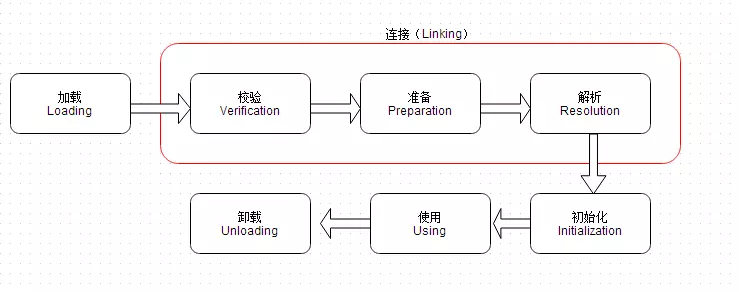
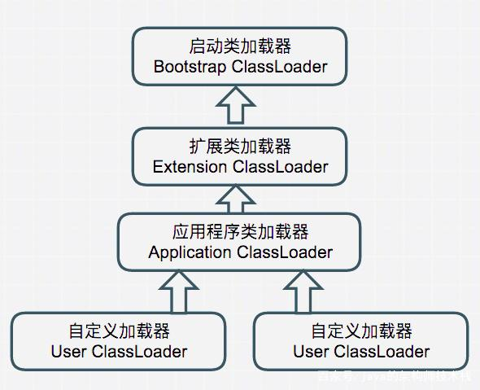

### 虚拟机类加载机制

#### 类加载的时机

类从被加载到虚拟机内存开始，到卸载出内存为止，它的整个生命周期包括，加载（Loading）、验证（Verification）、准备（Preparation）、解析（Resolution）、初始化（Initialization）、使用（Using）和卸载（UNloading）7个阶段。其中验证、准备、解析三个节点统称为连接（Linking），这7个阶段的发生顺序如下：



加载、验证、准备、初始化和卸载这5个阶段的顺序是确定，类的加载必须按这个顺序进行，但是解析阶段不一定：它在某些情况下可以在初始化阶段之后进行，为了支持java的运行时绑定。
虚拟机规范严格规定了有且只有5中情况必须对类进行初始化：
1. 遇到new、getstatic、putstatic活invokestatic这4条字节码指定时，如果类没有进行过初始化，则必须先触发初始化。生成这四条指令最常见的java代码场景：使用new关键词实例化对象、读取或设置一个类的静态字段（被final修饰、在编译器把结果放入常量池的静态字段除外）的时候，以及调用一个类的静态方法时候。
2. 使用java.lang.reflect包的方法对类进行反射调用的时候，如果类没有进行过初始化，则需要先进行初始化。
3. 当初始化一个类的时候，如果发现其父类还没有进行初始化，则需要先触发其父类的初始化。
4. 当虚拟机启动时，用户需要指定一个要执行的主类，虚拟机会先初始化这个类。
5. 当使用动态语言支持时，如果一个java.lang.invoke.MethodHandle实例最后的解析结果是REF_getStatic、REF_putStatic、REF_invokeStatic的方法句柄，并且这个方法句柄对应的类没有进行过初始化，则需要先触发初始化。

#### 类加载的过程

##### 加载

1. 通过一个类的全限定名来获取定义此类的二进制字节流。（不一定从class文件获取，也可以从ZIP包、网络、运行时计算生成（动态代理）、其他文件（JSP）、数据库获取）
2. 将这个字节流所代表的静态存储结构转换为方法区的运行时数据结构。
3. 在内存中生成一个代表这个类的java.lang.Class对象，作为方法区这个类的各种数据的访问入口。

##### 验证

此阶段主要确保Class文件的字节流中包含的信息符合当前虚拟机的要求，并且不会危害虚拟机的自身安全。

1. 文件格式验证：基于字节流验证。
2. 元数据验证：基于方法区的存储结构验证。
3. 字节码验证：基于方法区的存储结构验证。
4. 符号引用验证：基于方法区的存储结构验证。

##### 准备

为类变量分配内存，并将其初始化为默认值。（此时为默认值，在初始化的时候才会给变量赋值）即在方法区中分配这些变量所使用的内存空间。例如：
```
public static int value = 123;
```
此时在准备阶段过后的初始值为0而不是123；将value赋值为123的putstatic指令是程序被编译后，存放于类构造器<client>方法之中，所以把value赋值为123的过程在初始化阶段才会进行。

```
public static final int value = 123;
```
此时value的值在准备阶段过后就是123（类字段属性表中存在ConstantValue属性，编译时Javac会为value生成ConstantValue属性，在准备过程就会根据ConstantValue的设置将value复制为123）。

##### 解析

把类型中的符号引用转换为直接引用。

- 符号引用与虚拟机实现的布局无关，引用的目标并不一定要已经加载到内存中。各种虚拟机实现的内存布局可以各不相同，但是它们能接受的符号引用必须是一致的，因为符号引用的字面量形式明确定义在Java虚拟机规范的Class文件格式中。
- 直接引用可以是指向目标的指针，相对偏移量或是一个能间接定位到目标的句柄。如果有了直接引用，那引用的目标必定已经在内存中存在

主要有以下四种：
1. 类或接口的解析
2. 字段解析
3. 类方法解析
4. 接口方法解析

##### 初始化

初始化阶段是执行类构造器<client>方法的过程。<client>方法是由编译器自动收集类中的类变量的赋值操作和静态语句块中的语句合并而成的。虚拟机会保证<client>方法执行之前，父类的<client>方法已经执行完毕。如果一个类中没有对静态变量赋值也没有静态语句块，那么编译器可以不为这个类生成<client>()方法。

#### 类加载器

对于任意一个类，都需要由加载它的类加载器和这个类本身一同确立其在java虚拟机中的唯一性，每一个类加载器都拥有一个独立的类名称空间。比较两个类是否相等，只有在这两个类是同一个类加载器加载的前提下才有意义，否则，即使这两个类来源于同一个文件，被同一个虚拟机加载，只要加载它们的类加载器不同，那这两个类必定不相等。

```
public class ClassLoaderTest {
    public static void main(String[] args) throws Exception {
        ClassLoader loader = new ClassLoader() {
            @Override
            public Class<?> loadClass(String name) throws ClassNotFoundException {
                try {
                    String fileName = name.substring(name.lastIndexOf(".") + 1) + ".class";
                    InputStream is = getClass().getResourceAsStream(fileName);
                    if(is == null) {
                        return super.loadClass(name);
                    }
                    byte[] b = new byte[is.available()];
                    is.read(b);
                    return defineClass(name, b, 0, b.length);
                } catch (Exception e) {
                    throw new ClassNotFoundException(name);
                }
            }
        };
        Object obj = loader.loadClass("classloader.ClassLoaderTest");
        System.out.println(obj);
        System.out.println(obj instanceof ClassLoaderTest);
    }
}
```
以上代码会输出
```
class classloader.ClassLoaderTest
false
```
可以看出这个object的确是ClassLoaderTest实例化出来的对象，但是这个类与classloader.ClassLoaderTest做类型检查却返回false。

#### 双亲委派模式

从Java虚拟机的江都讲，只存在两种不同的类加载器：一种是启动类加载器（Bootstrap ClassLoader）,这个类加载器由C++实现，是虚拟机的一部分；另一种就是所有其他的类加载器，这些类加载器都由Java实现，全都继承于抽象类java.lang.ClassLoader。

JVM提供了以下3种系统的类加载器：

- 启动类加载器（Bootstrap ClassLoader）：最顶层的类加载器，负责加载 JAVA_HOME\lib 目录中的，或通过-Xbootclasspath参数指定路径中的，且被虚拟机认可（按文件名识别，如rt.jar）的类。
- 扩展类加载器(Extension ClassLoader)：负责加载 JAVA_HOME\lib\ext 目录中的，或通过java.ext.dirs系统变量指定路径中的类库。
- 应用程序类加载器(Application ClassLoader)：也叫做系统类加载器，可以通过getSystemClassLoader()获取，负责加载用户路径（classpath）上的类库。如果没有自定义类加载器，一般这个就是默认的类加载器。



类加载器之间的这种层次关系叫做双亲委派模型。 
双亲委派模型要求除了顶层的启动类加载器（Bootstrap ClassLoader）外，其余的类加载器都应当有自己的父类加载器。这里的类加载器之间的父子关系一般不是以继承关系实现的，而是用组合实现的。

##### 双亲委派模型的工作过程
如果一个类接受到类加载请求，他自己不会去加载这个请求，而是将这个类加载请求委派给父类加载器，这样一层一层传送，直到到达启动类加载器（Bootstrap ClassLoader）。 
只有当父类加载器无法加载这个请求时，子加载器才会尝试自己去加载。

##### 双亲委派模型的代码实现
双亲委派模型的代码实现集中在java.lang.ClassLoader的loadClass()方法当中。 
1. 首先检查类是否被加载，没有则调用父类加载器的loadClass()方法； 
2. 若父类加载器为空，则默认使用启动类加载器作为父加载器； 
3. 若父类加载失败，抛出ClassNotFoundException 异常后，再调用自己的findClass() 方法。

```
protected synchronized Class<?> loadClass(String name, boolean resolve) throws ClassNotFoundException {
    //1 首先检查类是否被加载
    Class c = findLoadedClass(name);
    if (c == null) {
        try {
            if (parent != null) {
             //2 没有则调用父类加载器的loadClass()方法；
                c = parent.loadClass(name, false);
            } else {
            //3 若父类加载器为空，则默认使用启动类加载器作为父加载器；
                c = findBootstrapClass0(name);
            }
        } catch (ClassNotFoundException e) {
           //4 若父类加载失败，抛出ClassNotFoundException 异常后
            c = findClass(name);
        }
    }
    if (resolve) {
        //5 再调用自己的findClass() 方法。
        resolveClass(c);
    }
    return c;
}
```
